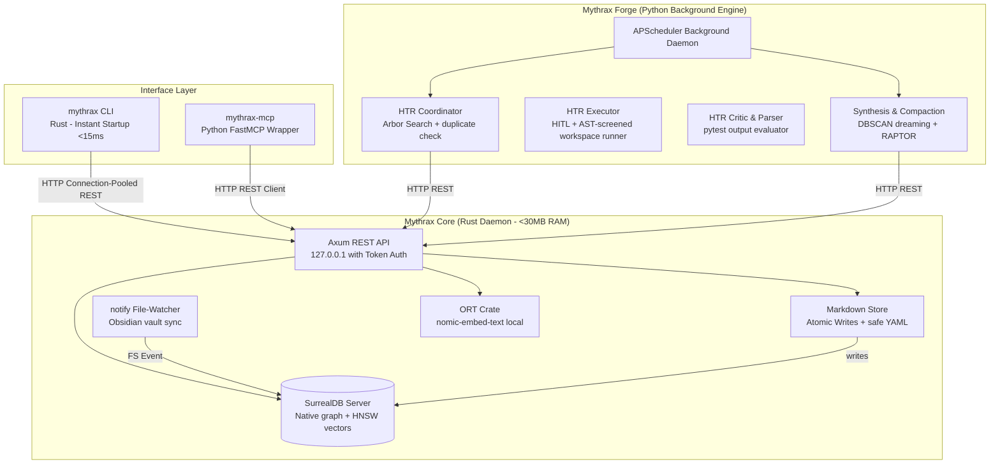

# ⚔️ Project Mythrax: Self-Improvement & Memory Engine

Project Mythrax is a hybrid-language local memory and cognitive self-improvement engine designed for autonomous AI agents. The engine is divided into two primary subsystems:
1.  **Mythrax Core** (Written in Rust): A low-latency local memory daemon, Axum REST API, and native SurrealDB/ONNX embedding retriever.
2.  **Mythrax Forge** (Written in Python): A background cognitive engine running Hypothesis Testing & Refinement (HTR), AST-gated execution sandboxing, DBSCAN epoch-based dreaming, and hierarchical RAPTOR summarization compaction.

---

## 🏗️ Architectural Overview & Data Flow



---

## 📡 Core API Specification

All REST endpoints are bound to localhost (`127.0.0.1`) and secured with header validation: `X-Mythrax-Token`.

### 1. Save Episode (`POST /v1/episodes`)
Atomic save and index of a new episodic context.
*   **Request:**
    ```json
    {
      "title": "Fixing cache invalidation",
      "content": "Observed cache mismatch in redis client. Resolved by...",
      "entities": [{"name": "RedisClient", "type": "class", "summary": "Handles connections"}],
      "scope": "mythrax-project"
    }
    ```
*   **Response:**
    ```json
    {
      "id": "episode:9b1deb4d-3b7d-4bad-9bdd-2b0d7b3d207b",
      "status": "indexed"
    }
    ```

### 2. Search Memories (`POST /v1/search`)
Combined vector and graph similarity retrieval.
*   **Request:**
    ```json
    {
      "query": "caching mismatch",
      "scope": "mythrax-project",
      "limit": 3
    }
    ```
*   **Response:**
    ```json
    [
      {
        "id": "episode:9b1deb4d-3b7d-4bad-9bdd-2b0d7b3d207b",
        "title": "Fixing cache invalidation",
        "content": "Observed cache mismatch in redis...",
        "similarity": 0.84,
        "utility": 1.0,
        "tier": "dynamic"
      }
    ]
    ```

### 3. Record Feedback (`POST /v1/feedback`)
Applies Exponential Moving Average (EMA) reinforcement to dynamic rules: `utility = 0.3 * success + 0.7 * previous_utility`.
*   **Request:**
    ```json
    {
      "id": "wisdom:dynamic_rule_xyz",
      "success": true
    }
    ```
*   **Response:**
    ```json
    {
      "status": "reinforced",
      "new_utility": 0.79
    }
    ```

### 4. Fetch/Update LLM Configuration (`GET/POST /v1/config/llm`)
Permits dynamic switching between cloud (Gemini/Claude) and local (mlx/ollama) providers, permanently or with an auto-expiry timeframe (e.g. `"2h"`, `"1d"`).

---

## 🛠️ CLI Command Reference

### Core CLI (`mythrax`)
*   `mythrax init` — Set up directories, download local tokenizer/embedding models, and initialize database schemas.
*   `mythrax daemon start [--port <port>]` — Starts the Axum server and vault file watcher.
*   `mythrax daemon stop` — Stops the background daemon.
*   `mythrax search <query> [--scope <scope>] [--limit <limit>]` — Performs vector and graph search.
*   `mythrax status` — Details DB connections, memory footprint, and watcher health.
*   `mythrax config llm --provider <local|cloud> [--timeframe <duration>]` — Toggles LLM configurations.

### Forge CLI (`mythrax-forge`)
*   `mythrax-forge run <script_path>` — Runs a script through AST-guided sandbox validation.
*   `mythrax-forge compact` — Forces vertical/horizontal tree summarization (RAPTOR) epochs.
*   `mythrax-forge dream` — Runs incremental synthesis (DBSCAN) over new episodes.

---

## 🚀 Quick Start / Try It Out

### 1. Download Pre-requisites & Models
Setup SurrealDB and grab Nomic Embed ONNX models:
```bash
chmod +x ./scripts/download_assets.sh
./scripts/download_assets.sh
```

### 2. Bootstrapping
Install Python packages and start the Core memory daemon:
```bash
# Set up Python venv
python3 -m venv .venv
source .venv/bin/activate
pip install -e ./mythrax-forge -e ./mythrax-mcp

# Initialize directories & schema
cargo run --bin mythrax -- init

# Start Core daemon
cargo run --bin mythrax -- daemon start &
```

### 3. Execute Compliance Installation
Install the required agent hooks:
```bash
./scripts/install_hooks.sh
```

---

## 🛡️ Programmatic Compliance Enforcement

To prevent agent compliance rules from being lost during context compactions, the system uses two deterministic gates:
1.  **Antigravity pre-invocation hook (`hooks.json`)**: Configured at `~/.gemini/config/hooks.json`, this hook automatically executes `/Users/keith/.gemini/antigravity/scratch/verify_compliance.py` before every model turn. Any compliance violations (such as failure to query memory or an offline daemon) are printed and injected directly into the agent's context.
2.  **Git lifecycle hooks**: Installed in the repository (`pre-commit`, `pre-push`, `post-checkout`, `post-merge`), blocking code modifications and commits unless compliance is successfully met.

---

## 📚 References & Inspiration

Project Mythrax is heavily inspired by the following research and cognitive architectures:
*   **Arbor Cognitive Architecture:** The core hypothesis-generation, execution testing, and criticism loop (HTR) is designed around the principles described in the Arbor research paper: [Arbor: A Framework for Self-Improving Agents](https://share.google/vGt70fyOADsQuUlf1).
*   **RAPTOR:** Recursive Abstractive Processing for Tree-Organized Retrieval (RAPTOR) is utilized for building hierarchical memory summaries.
*   **DBSCAN:** Used for episodic clustering and dreaming consolidation epochs.

