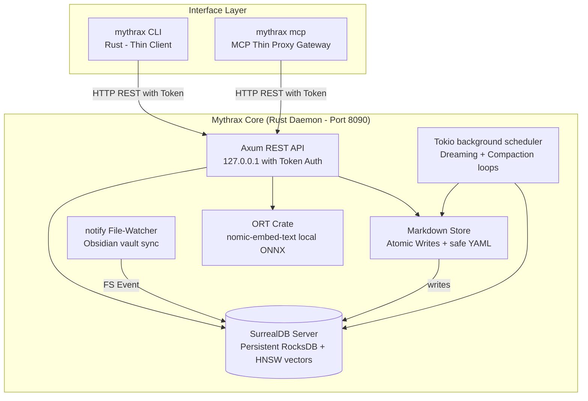

# ⚔️ Project Mythrax: Self-Improvement & Memory Engine

Project Mythrax is a 100% native Rust local memory and cognitive self-improvement engine designed for autonomous AI agents. The engine is unified under a single high-performance library and binary:
- **Mythrax Core**: A low-latency local memory daemon, Axum REST API, native SurrealDB/ONNX embedding retriever, DBSCAN epoch-based dreaming scheduler, and hierarchical RAPTOR summarization compaction.

---

## 📖 Documentation Index

For in-depth guides, architectural references, and developer playbooks, see the following documentation:

- **[User Guide](file:///Users/keith/Documents/self-improvement-engine/mythrax_user_guide.md)**: A complete reference manual covering core memory entities, the Smart Handoff protocol, the ingestion pipeline, and a comprehensive CLI/MCP tool reference.
- **[Architecture Reference](file:///Users/keith/Documents/self-improvement-engine/ARCHITECTURE.md)**: Detailed specifications of the client-server topology, RocksDB single-writer integrity, token security, and SurrealDB graph schemas.
- **[Developer Guide](file:///Users/keith/Documents/self-improvement-engine/DEVELOPMENT.md)**: A step-by-step guide for developers on how to add or extend tools under the new action-enum-based architecture.
- **[Agent Skill Playbook](file:///Users/keith/Documents/self-improvement-engine/.agents/skills/mythrax/SKILL.md)**: Guidelines and rules for AI agents utilizing the Mythrax MCP server, including the pre-invocation hook boot check compliance.

---

## 🏗️ Architectural Overview & Data Flow

Mythrax 1.0 employs a lightweight, stateless client-server topology. The CLI and the MCP server act as thin HTTP clients, while the heavy lifting is offloaded to a persistent, central daemon process. This guarantees that RocksDB is only ever opened by the daemon, entirely eliminating process lock contention.

**Zero-CLI Autonomy**: For users interacting with Mythrax solely through the MCP server (such as via Cursor or VS Code), the MCP server automatically pings and spawns the background daemon on startup. This detached daemon activates all background scheduling loops—including the Obsidian file watcher, the daily deep dreaming cycle, and the inactivity-debounced compaction loop—without requiring any CLI interaction.



---

## 📡 Core API Specification

All REST endpoints are bound to localhost (`127.0.0.1:8090`) and secured with header validation: `X-Mythrax-Token`.

### 1. Save Episode (`POST /v1/episodes`)
Atomic save and index of a new episodic context.
- **Request:**
  ```json
  {
    "title": "Fixing cache invalidation",
    "content": "Observed cache mismatch in redis client. Resolved by...",
    "entities": [{"name": "RedisClient", "type": "class", "summary": "Handles connections"}],
    "scope": "mythrax-project"
  }
  ```
- **Response:**
  ```json
  {
    "id": "episode:9b1deb4d-3b7d-4bad-9bdd-2b0d7b3d207b",
    "status": "success"
  }
  ```

### 2. Search Memories (`POST /v1/search`)
Combined vector and graph similarity retrieval.
- **Request:**
  ```json
  {
    "query": "caching mismatch",
    "scope": "mythrax-project",
    "limit": 3
  }
  ```
- **Response:**
  ```json
  {
    "results": [
      {
        "id": "episode:9b1deb4d-3b7d-4bad-9bdd-2b0d7b3d207b",
        "title": "Fixing cache invalidation",
        "content": "Observed cache mismatch in redis...",
        "similarity": 0.84,
        "utility": 1.0,
        "tier": "dynamic"
      }
    ]
  }
  ```

### 3. Record Feedback (`POST /v1/feedback`)
Applies Exponential Moving Average (EMA) reinforcement to dynamic rules: `utility = 0.3 * success + 0.7 * previous_utility`.

### 4. Fetch/Update LLM Configuration (`GET/POST /v1/config/llm`)
Permits dynamic switching between cloud (Gemini/Claude) and local (mlx/ollama) providers.

---

## 🛠️ CLI Command Reference

All client commands automatically forward requests to the background daemon over HTTP. If the daemon is not running, the CLI automatically spawns the daemon in the background and waits for it to bind.

-   `mythrax init [harness] [--source <path>]` — Set up fresh RocksDB cache, SurrealDB schemas, and creates Obsidian subfolders.
-   `mythrax daemon start [--port <port>]` — Starts the REST API daemon on the specified port in the background.
-   `mythrax daemon stop` — Safely stops the running daemon using the tracked PID.
-   `mythrax daemon run [--port <port>]` — Runs the daemon in the foreground (useful for local testing and logs).
-   `mythrax memory query <query> [--scope <scope>] [--limit <limit>]` — Queries long-term memory using vector search (with text substring fallback if embeddings are missing).
-   `mythrax memory record --file <path>` — Saves a markdown file as an episodic memory in the vault.
-   `mythrax memory feedback <id> <success>` — Records success/failure feedback for a wisdom rule.
-   `mythrax memory root` — Retrieves the active Obsidian vault root directory path.
-   `mythrax htr <action> [args]` — Manages Hypothesis-Tree Refinement (Arbor) loops (`init`, `ideate`, `execute`, `backprop`, `merge`, `run`).
-   `mythrax stm <action> [args]` — Manages short-term memory keys and handoffs (`put`, `get`, `clear`, `handoff`).
-   `mythrax vault <action> [args]` — Manages vault lifecycle operations (`organize`, `verify`, `reprocess`, `summarize`).
-   `mythrax config <action> [args]` — Gets or sets LLM provider configurations.
-   `mythrax ingest bulk --source <dir>` — Bulk ingests logs and transcripts from target harnesses.
-   `mythrax ingest forge <source_path>` — Chunks and parses manuals or documents into rules/wiki nodes.
-   `mythrax audit` — Runs safety compliance audits on the active directory.
-   `mythrax mcp` — Runs the native stdin/stdout JSON-RPC 2.0 MCP server (transparent thin client gateway).

---

## 🛡️ Programmatic Compliance Enforcement

To enforce compliance, a pre-invocation hook automatically executes `verify_compliance` and `pre_invocation_hook` before every model turn, checking tailwind compliance, search history cleanup, and daemon health.

---

## 💡 Inspirations & References

Project Mythrax builds upon several pioneering concepts in modern AI engineering, database design, and cognitive architectures:

1. **The LLM OS & Software 2.0 (Andrej Karpathy)**: Guided by the vision of a lean, highly observable, and thin-client orchestration layer surrounding the LLM, prioritizing surgical code changes, rigorous testing, and direct execution over complex framework abstractions.
2. **Model Context Protocol (MCP - Anthropic)**: Standardizes how local memory engines expose context, tools, and resources to frontier language models.
3. **Human-Readable Vaults (Obsidian)**: Adopts plain-text markdown files as the ultimate source of truth, ensuring that the agent's memory graph remains fully inspectable, navigable, and editable by human developers.
4. **Multi-Model Graph Databases (SurrealDB)**: Harmonizes document storage, graph relations, and vector indexes into a single cohesive engine, enabling bidirectional semantic citations and deep graph traversal.
5. **RAPTOR (Recursive Abstractive Processing for Tree-Organized Retrieval)**: Guides the hierarchical summarization and compaction layers to build tree-structured memory networks that retain long-term context.
6. **HTR (Hypothesis-Tree Refinement / Arbor)**: Adapts tree-of-thought exploration and execution feedback loops for autonomous software engineering and self-improvement tasks.

---

## 🚀 Quick Start / Try It Out

### 1. Bootstrapping
Build the project, initialize the database directories, and configure your target harness:
```bash
# Build binary
cargo build --release

# Initialize for antigravity harness
./mythrax-core/target/release/mythrax init antigravity
```

### 2. Start Daemon
Start the memory server in the background:
```bash
./mythrax-core/target/release/mythrax daemon start
```

### 3. Run Tests
Verify compile and test status:
```bash
cargo test
```
