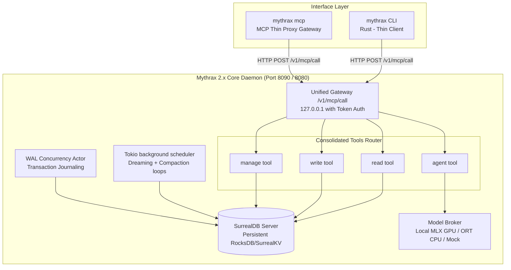

# ⚔️ Project Mythrax: Sidecar Intelligence & Memory Engine

Project Mythrax is a 100% native Rust local memory, model routing, and cognitive self-improvement engine designed for autonomous AI agents. The system is unified under a high-performance library and central daemon:

- **Mythrax Core**: A low-latency sidecar intelligence daemon, single-port API gateway (port `8090`), transparent completions proxy (port `8080`), native SurrealKV/RocksDB persistent database engine, split GPU semaphore model broker, and epoch-based DBSCAN/RAPTOR memory compaction scheduler.

---

## 🎯 Core System Goals & Objectives

To fulfill its role as a persistent, autonomous sidecar intelligence companion, Mythrax commits to five fundamental objectives:

1. **Short-Term Context Recall & Compaction Recovery:** Provide immediate short-term retrieval for active agents operating with large context windows. Memory compaction must preserve the granular sequence of raw turns (user inputs, assistant thoughts, tool outputs) so agents can review their immediate past steps and avoid forgetting loops.
2. **Project-Level Memory (Insights):** Build high-cohesion, project-specific knowledge representations (`wiki_node` / clusters) so that multiple agents or sequential sessions on the same codebase share operational constraints and context.
3. **Cross-Project Global Memory (Wisdom):** Maintain a durable, global partition (`wisdom`) for general guidelines, coding practices, user preferences, and architectural rules that apply universally across workspaces (e.g. general design principles).
4. **Forged Knowledge & Skill Integration:** Enable raw reference assets (like PDFs, specs, and papers) and composed agent strategies (e.g. chaining `spec-builder`, `loop-builder`, and reviewers) to be dynamically injected via RAG into active context windows on-demand.
5. **Resource-Efficient Memory Brokerage:** Optimize token footprint and compute overhead using local models (`mlx-community/Qwen3.6-35B-A3B-4bit`) for text embeddings, token budget management, and code generation.

---

## 📖 Documentation Index

For in-depth guides, architectural references, and developer playbooks, see the following documentation:

- **[User Guide](mythrax_user_guide.md)**: A complete reference manual covering core memory entities, the Smart Handoff protocol, the ingestion pipeline, and a comprehensive CLI/MCP tool reference.
- **[Architecture Reference](ARCHITECTURE.md)**: Detailed specifications of the single-port gateway, dual-engine database persistence, VRAM safeguards, WAL concurrency, and graceful shutdown lifecycles.
- **[Developer Guide](DEVELOPMENT.md)**: A step-by-step guide for developers on how to add or extend tools under the action-enum-based architecture.
- **[Agent Skill Playbook](.agents/skills/mythrax/SKILL.md)**: Guidelines and rules for AI agents utilizing the Mythrax MCP server, including the pre-invocation hook boot check compliance.

---

## 🏗️ Architectural Overview & Data Flow

Mythrax 2.x employs a lightweight sidecar intelligence topology. The CLI and external MCP integrations act as thin HTTP/RPC clients, while heavy operations are offloaded to a persistent, central daemon process. This guarantees database locks are held exclusively by the daemon, eliminating process write contention.

**Zero-CLI Autonomy**: For agents interacting through the MCP server (e.g. in Cursor, VS Code, or Antigravity), the MCP server automatically pings and spawns the background daemon on startup. This detached daemon runs all background scheduling loops—including the Obsidian file watcher, the daily deep dreaming cycle, the inactivity-debounced compaction loop, and WAL flushing—without requiring any manual CLI interaction.



---

## 📡 Unified API Specification

All client requests are routed through a single, unified POST API gateway (`127.0.0.1:8090/v1/mcp/call`) and secured with header validation: `X-Mythrax-Token`.

### 1. Save Episodic Memory (via `write` tool)
Atomic save and index of a new episodic context.
- **Request:**
  ```json
  {
    "name": "write",
    "arguments": {
      "action": "save",
      "title": "Fixing VRAM database locks",
      "content": "Resolved database lock contention in test runs by adding a 10-attempt retry loop...",
      "scope": "general"
    }
  }
  ```
- **Response:**
  ```json
  {
    "content": [
      {
        "type": "text",
        "text": "Saved memory card. ID: episode:9b1deb4d-3b7d-4bad-9bdd-2b0d7b3d207b"
      }
    ]
  }
  ```

### 2. Search Memories (via `read` tool)
Combined vector and graph similarity retrieval utilizing Hybrid Reciprocal Rank Fusion (RRF).
- **Request:**
  ```json
  {
    "name": "read",
    "arguments": {
      "action": "search",
      "query": "VRAM lock retry",
      "scope": "general",
      "limit": 3
    }
  }
  ```
- **Response:**
  ```json
  {
    "content": [
      {
        "type": "text",
        "text": "#### 📑 Memory Card: Fixing VRAM database locks\n- **ID**: `episode:9b1deb4d-3b7d-4bad-9bdd-2b0d7b3d207b`\n- **Scope**: `general`\n- **Summary**: Resolved database lock contention in..."
      }
    ]
  }
  ```

### 3. Record Feedback (via `write` tool)
Applies Exponential Moving Average (EMA) reinforcement to dynamic rules: `utility = 0.3 * success + 0.7 * previous_utility`.
- **Request:**
  ```json
  {
    "name": "write",
    "arguments": {
      "action": "feedback",
      "episode_id": "episode:9b1deb4d-3b7d-4bad-9bdd-2b0d7b3d207b",
      "success": true
    }
  }
  ```

### 4. Fetch/Update LLM Configuration (via `write`/`read` tools)
Permits dynamic switching between cloud (Gemini) and local (Qwen via local OpenAI-compatible endpoints) providers.
- **Request:**
  ```json
  {
    "name": "write",
    "arguments": {
      "action": "set",
      "provider": "local",
      "model": "mlx-community/Qwen3.6-35B-A3B-4bit"
    }
  }
  ```

---

## 🛠️ CLI Command Reference

All client commands automatically forward requests to the background daemon over HTTP. If the daemon is not running, the CLI automatically spawns the daemon in the background and waits for it to bind.

-   `mythrax init [harness] [--source <path>]` — Set up fresh database caches, SurrealDB schemas, and creates Obsidian subfolders.
-   `mythrax daemon start [--port <port>]` — Starts the REST API daemon on the specified port (default `8090`) in the background.
-   `mythrax daemon stop` — Safely stops the running daemon using the tracked PID and triggers the graceful shutdown sequence.
-   `mythrax daemon run [--port <port>]` — Runs the daemon in the foreground (useful for local testing and logs).
-   `mythrax memory query <query> [--scope <scope>] [--limit <limit>]` — Queries long-term memory using vector search (with text substring fallback if embeddings are missing).
-   `mythrax memory record --file <path>` — Saves a markdown file as an episodic memory in the vault.
-   `mythrax memory feedback <id> <success>` — Records success/failure feedback for a wisdom rule.
-   `mythrax memory root` — Retrieves the active Obsidian vault root directory path.
-   `mythrax htr <action> [args]` — Manages Hypothesis-Tree Refinement (Arbor) loops (`init`, `ideate`, `execute`, `backprop`, `merge`, `run`).
-   `mythrax stm <action> [args]` — Manages short-term memory keys and handoffs (`put`, `get`, `clear`, `handoff`).
-   `mythrax vault <action> [args]` — Manages vault lifecycle operations (`organize`, `verify`, `reprocess`, `summarize`, `audit`).
-   `mythrax config <action> [args]` — Gets or sets LLM provider configurations.
-   `mythrax ingest bulk --source <dir>` — Bulk ingests logs and transcripts from target harnesses.
-   `mythrax ingest forge <source_path>` — Chunks and parses manuals or documents into rules/wiki nodes.
-   `mythrax audit` — Runs safety compliance audits on the active directory.
-   `mythrax mcp` — Runs the native stdin/stdout JSON-RPC 2.0 MCP server (transparent thin client gateway).

---

## 🛡️ Programmatic Compliance Enforcement

To enforce compliance, a pre-invocation hook automatically executes `verify_compliance` and `pre_invocation_hook` before every model turn, checking code styles, search history cleanups, and daemon health, and injecting status blocks under:
```markdown
### 🤖 Local Inference & Model Broker Status
```

---

## 🚀 Quick Start & Integration

### 1. Build and Initialize
Build the optimized release binary and initialize your desired agent harness environment.

```bash
# Build the production release binary
cargo build --release

# Initialize for Google Antigravity SDK
./target/release/mythrax init antigravity

# Or initialize for Claude (WARNING: currently UNTESTED)
./target/release/mythrax init claude
```

> [!NOTE]
> Running `mythrax init antigravity` automatically performs the following local configurations:
> 1. Registers the **Mythrax MCP server** in `~/.gemini/config/mcp_config.json`.
> 2. Registers the **Pre-Invocation Hook** in `~/.gemini/config/hooks.json` under `mythrax-compliance`.
> 3. Installs the global **`/mythrax` Skill Playbook** at `~/.gemini/config/skills/mythrax/SKILL.md`.
>
> Claude Desktop/Code integration (`mythrax init claude`) is currently **untested** and does not support hooks natively.

### 2. Start the Daemon
Launch the central memory daemon. For Antigravity agents, the daemon will automatically spawn in the background on the first MCP request if it is not already running.
```bash
./target/release/mythrax daemon start
```

### 3. Verification & Testing
Verify that your local build is stable and pass integration checks:
```bash
MYTHRAX_TEST_MOCK=1 cargo nextest run --features mlx
```

### 4. Hook Registrations & Integration

#### Pre-Invocation Hook (Auto-Installed)
The pre-invocation hook executes immediately before each model turn. It verifies the workspace, checks memory daemon health, and compiles active context node IDs into the short-term memory (STM) cache.
* **Location**: Configured inside `~/.gemini/config/hooks.json`:
  ```json
  "mythrax-compliance": {
    "PreInvocation": [
      {
        "type": "mcp",
        "server": "mythrax",
        "tool": "manage",
        "arguments": {
          "action": "pre_invocation"
        }
      }
    ]
  }
  ```

#### Pre-Compaction (Precompact) Hook
The pre-compaction hook runs asynchronously at the end of an agent session or workflow milestone to mine transcripts, extract wisdom rules/insights, and write them to the Obsidian vault.

##### 1. Google Antigravity Setup (hooks.json)
Configure inside `~/.gemini/config/hooks.json` under the `"mythrax-compliance"` key to trigger automatically at compaction milestones:
```json
"PreCompaction": [
  {
    "type": "mcp",
    "server": "mythrax",
    "tool": "manage",
    "arguments": {
      "action": "precompact",
      "session_id": "{{conversation_id}}",
      "transcript_path": "{{transcript_path}}"
    }
  }
]
```

##### 2. Claude Code Setup (.claude/settings.json)
Trigger automatically at session termination using the `SessionEnd` lifecycle hook in `~/.claude/settings.json`:
```json
{
  "hooks": {
    "SessionEnd": [
      {
        "type": "command",
        "command": "curl -X POST http://127.0.0.1:8090/v1/hooks/precompact -H 'Content-Type: application/json' -H \"X-Mythrax-Token: $(cat ~/.mythrax/token)\" -d \"{\\\"session_id\\\": \\\"$CLAUDE_SESSION_ID\\\", \\\"transcript_path\\\": \\\"$CLAUDE_TRANSCRIPT_PATH\\\"}\""
      }
    ]
  }
}
```

##### 3. Manual Exec via HTTP POST
```bash
curl -X POST http://127.0.0.1:8090/v1/hooks/precompact \
  -H "Content-Type: application/json" \
  -H "X-Mythrax-Token: $(cat ~/.mythrax/token)" \
  -d '{
    "session_id": "session_abc123",
    "transcript_path": "/absolute/path/to/transcript.jsonl"
  }'
```

