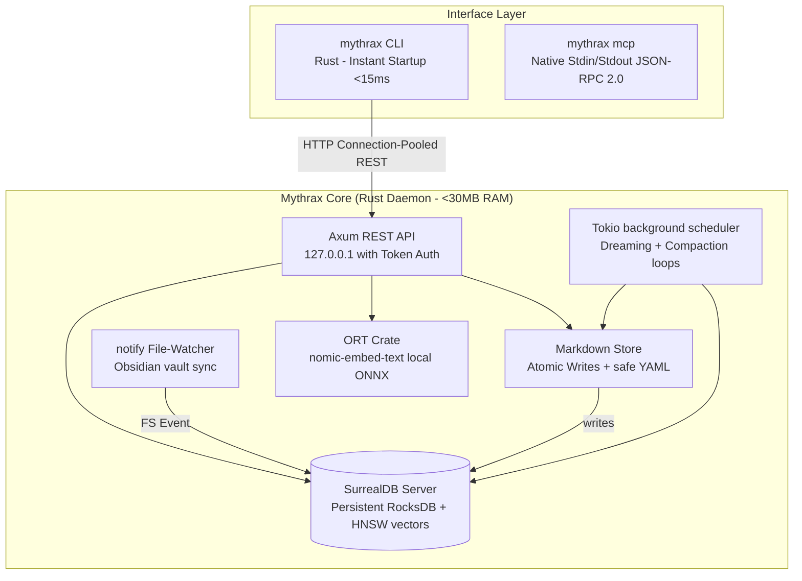

# ⚔️ Project Mythrax: Self-Improvement & Memory Engine

Project Mythrax is a 100% native Rust local memory and cognitive self-improvement engine designed for autonomous AI agents. The engine is unified under a single high-performance library and binary:
- **Mythrax Core**: A low-latency local memory daemon, Axum REST API, native SurrealDB/ONNX embedding retriever, DBSCAN epoch-based dreaming scheduler, and hierarchical RAPTOR summarization compaction.

---

## 🏗️ Architectural Overview & Data Flow



---

## 📡 Core API Specification

All REST endpoints are bound to localhost (`127.0.0.1`) and secured with header validation: `X-Mythrax-Token`.

### 1. Save Episode (`POST /v1/episodes`)
Atomic save and index of a new episodic context.
*   **Request:**
    ```json
    {
      "title": "Fixing cache invalidation",
      "content": "Observed cache mismatch in redis client. Resolved by...",
      "entities": [{"name": "RedisClient", "type": "class", "summary": "Handles connections"}],
      "scope": "mythrax-project"
    }
    ```
*   **Response:**
    ```json
    {
      "id": "episode:9b1deb4d-3b7d-4bad-9bdd-2b0d7b3d207b",
      "status": "success"
    }
    ```

### 2. Search Memories (`POST /v1/search`)
Combined vector and graph similarity retrieval.
*   **Request:**
    ```json
    {
      "query": "caching mismatch",
      "scope": "mythrax-project",
      "limit": 3
    }
    ```
*   **Response:**
    ```json
    [
      {
        "id": "episode:9b1deb4d-3b7d-4bad-9bdd-2b0d7b3d207b",
        "title": "Fixing cache invalidation",
        "content": "Observed cache mismatch in redis...",
        "similarity": 0.84,
        "utility": 1.0,
        "tier": "dynamic"
      }
    ]
    ```

### 3. Record Feedback (`POST /v1/feedback`)
Applies Exponential Moving Average (EMA) reinforcement to dynamic rules: `utility = 0.3 * success + 0.7 * previous_utility`.

### 4. Fetch/Update LLM Configuration (`GET/POST /v1/config/llm`)
Permits dynamic switching between cloud (Gemini/Claude) and local (mlx/ollama) providers, permanently or with an auto-expiry timeframe (e.g. `"2h"`, `"1d"`).

---

## 🛠️ CLI Command Reference

### Core CLI Commands (`mythrax`)
*   `mythrax init [harness] [--source <path>]` — Set up fresh RocksDB cache, SurrealDB schemas, and creates Obsidian subfolders. If harness name is provided, configures it.
*   `mythrax config <harness> [--source <path>]` — Merges Mythrax MCP and hook configurations without wiping the database. Supported harnesses: `antigravity`, `claude`, `cursor`, `codex`, `opencode`, `openclaw`, `hermes`.
*   `mythrax config llm --provider <local|cloud> [--model <model>] [--cloud-provider <name>] [--api-key <key>]` — Configures model/embedding provider settings and cloud API keys (saved securely in private file `~/.mythrax/keys.json` with `0600` permissions).
*   `mythrax daemon start [--port <port>] [--vault <path>]` — Starts the Axum server, watcher, and background tokio synthesis scheduler.
*   `mythrax daemon stop` — Safely stops the running daemon using the PID file.
*   `mythrax status` — Details configuration and connection settings.
*   `mythrax search <query> [--scope <scope>] [--limit <limit>]` — Performs vector and graph search.
*   `mythrax vault ingest --source <dir> --harness <type> [--scope <scope>]` — Bulk ingests logs from target harnesses.
*   `mythrax vault organize` — Resolves duplicate notes and vault structures.
*   `mythrax vault summarize [--scope <scope>]` — Compacks and summarizes episodes.
*   `mythrax vault verify [--fix]` — Runs graph and file-to-db integrity verification.
*   `mythrax vault reprocess` — Recalculates embeddings for episodes stored during offline/missing model state.
*   `mythrax mcp` — Runs the native stdin/stdout JSON-RPC 2.0 MCP server.

---

## 🛡️ Programmatic Compliance Enforcement

To enforce compliance, a single primary Gemini hook executes `./target/debug/mythrax verify` before every model turn, checking tailwind compliance, search history cleanup, and daemon health.

---

## 🚀 Quick Start / Try It Out

### 1. Bootstrapping
Build the project, initialize the database directories, and configure your target harness:
```bash
# Build binary
cargo build --release

# Initialize for antigravity harness
./target/release/mythrax init antigravity
```

### 2. Start Daemon
Start the memory server:
```bash
./target/release/mythrax daemon start
```

### 3. Run Tests
Verify compile and test status:
```bash
cargo test
```
