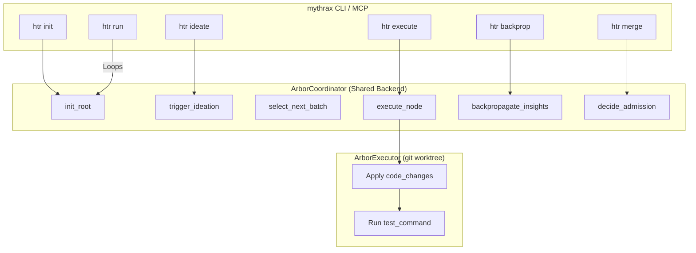

# Design - HTR Loop Generalization & CLI/MCP Integration

## Overview
We will generalize the HTR loop components (`ArborCoordinator`, `ArborExecutor`, `ArborCritic`) and update the `LLMClient` to support dynamic scopes, arbitrary test commands, target files, and dynamic code changes. We will also expose these capabilities through both end-to-end and low-level CLI commands and MCP tools.

Additionally, we will correct the schema definition of the `hypothesis_node` table in `INIT_SCHEMA` which currently mismatches the `HypothesisNode` structure.



## Data and State
We will update `HypothesisNode` in `contracts.rs` and the SurrealDB schema in `schema.rs`.

### 1. `contracts.rs` Struct
```rust
#[derive(Debug, Clone, Serialize, Deserialize)]
pub struct HypothesisNode {
    pub node_id: String,
    pub parent_id: Option<String>,
    pub children_ids: Vec<String>,
    pub depth: i32,
    pub hypothesis: String,
    pub status: String,
    pub score: Option<f32>,
    pub result: Option<String>,
    pub insight: Option<String>,
    pub code_ref: Option<String>,
    pub code_changes: Option<std::collections::HashMap<String, String>>,
    pub scope: Option<String>,
    pub vault_path: Option<String>,
}
```

### 2. `schema.rs` Table Update
```rust
    DEFINE TABLE hypothesis_node SCHEMAFULL;
    DEFINE FIELD node_id ON hypothesis_node TYPE string;
    DEFINE FIELD parent_id ON hypothesis_node TYPE option<string>;
    DEFINE FIELD children_ids ON hypothesis_node TYPE array<string>;
    DEFINE FIELD depth ON hypothesis_node TYPE int;
    DEFINE FIELD hypothesis ON hypothesis_node TYPE string;
    DEFINE FIELD status ON hypothesis_node TYPE string DEFAULT 'pending';
    DEFINE FIELD score ON hypothesis_node TYPE option<float>;
    DEFINE FIELD result ON hypothesis_node TYPE option<string>;
    DEFINE FIELD insight ON hypothesis_node TYPE option<string>;
    DEFINE FIELD code_ref ON hypothesis_node TYPE option<string>;
    DEFINE FIELD code_changes ON hypothesis_node TYPE option<object>;
    DEFINE FIELD scope ON hypothesis_node TYPE string DEFAULT 'general';
    DEFINE FIELD vault_path ON hypothesis_node TYPE string DEFAULT '';
    DEFINE INDEX node_id_idx ON hypothesis_node FIELDS node_id UNIQUE;
    DEFINE INDEX hypothesis_scope ON hypothesis_node FIELDS scope;
```

## Interfaces & CLI Command Specification
A new subcommand group `htr` is added to `Commands` in `cli.rs`:

```rust
pub enum Commands {
    // ...
    Htr {
        #[command(subcommand)]
        action: HtrAction,
    },
}

pub enum HtrAction {
    Init {
        #[arg(short, long)]
        scope: String,
        #[arg(short, long)]
        hypothesis: String,
        #[arg(short, long, value_delimiter = ',')]
        files: Vec<String>,
    },
    Ideate {
        #[arg(short, long)]
        scope: String,
        #[arg(short, long)]
        node: String,
    },
    Execute {
        #[arg(short, long)]
        scope: String,
        #[arg(short, long)]
        node: String,
        #[arg(short, long)]
        test_command: String,
    },
    Backprop {
        #[arg(short, long)]
        scope: String,
        #[arg(short, long)]
        node: String,
    },
    Merge {
        #[arg(short, long)]
        scope: String,
        #[arg(short, long)]
        node: String,
    },
    Run {
        #[arg(short, long)]
        scope: String,
        #[arg(short, long)]
        hypothesis: String,
        #[arg(short, long, value_delimiter = ',')]
        files: Vec<String>,
        #[arg(short, long)]
        test_command: String,
        #[arg(long, default_value_t = 5)]
        max_steps: usize,
    },
}
```

## Execution Flow

### 1. `ArborCoordinator` Parametrization
```rust
pub struct ArborCoordinator<L: ArborLlmClient> {
    db: Surreal<Db>,
    backend: crate::db::SurrealBackend,
    vault_root: PathBuf,
    repo_path: PathBuf,
    llm_client: L,
    scope: String,
    test_command: String,
    target_files: Vec<String>,
}
```

### 2. Executor Sandboxing (`executor.rs`)
Before running `test_command` in `/tmp/worktree-node-<id>`:
- The executor reads `node.code_changes`.
- If present, it iterates through the map and writes the proposed new file contents to their respective relative paths inside the worktree directory.
- It then executes the test command.

### 3. Admission Control & Merge Gate (`arbor.rs`)
In `decide_admission`:
- Apply the selected node's `code_changes` map directly to the main repository files.
- Commit the changes on the main branch: `git commit -am "Apply HTR refinement: [hypothesis] (Score: [score])"`.

### 4. LLM Prompts Update (`llm/mod.rs`)
We update `ArborLlmClient` to pass target files contents to the LLM during ideation:
- System instruction: *"You are an autonomous research ideator. Based on the target file contents and parent hypothesis, suggest two distinct refinements. For each refinement, you MUST provide the sequential node_id, description, utility score (0.0 to 100.0), and a 'code_changes' map containing relative paths to the complete new file content of the modified target files."*
- Propose schema format:
  ```json
  [
    {
      "node_id": "1",
      "hypothesis": "...",
      "score": 90.0,
      "code_changes": {
        "src/main.rs": "...new code..."
      }
    }
  ]
  ```

## Safety Boundaries
- **Worktree isolation**: Executions run entirely inside `/tmp/worktree-node-<id>`.
- **Git protection**: If the main branch has uncommitted changes, HTR execution will run tests on the uncommitted changes as part of the base context, but the final `merge` will fail cleanly if git status is dirty (requiring clean state to commit).

## Observability
- All HTR steps write to the database and write Obsidian notes under `wiki/<scope>/hypothesis_tree/<node_id>.md`.
- Detailed CLI/daemon logs trace HTR progress.
