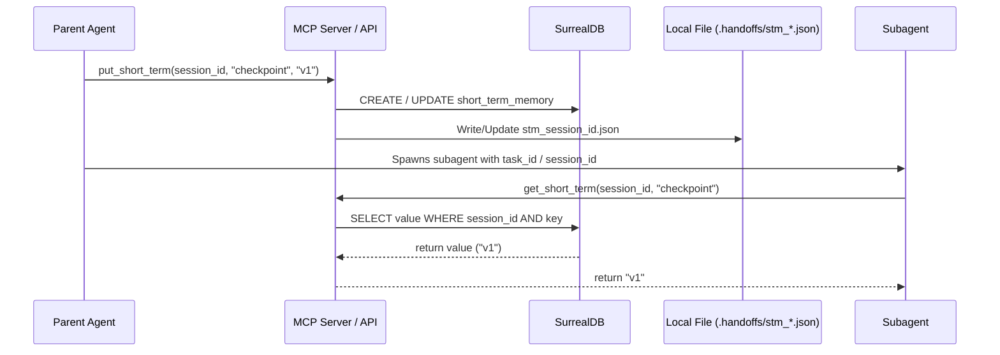
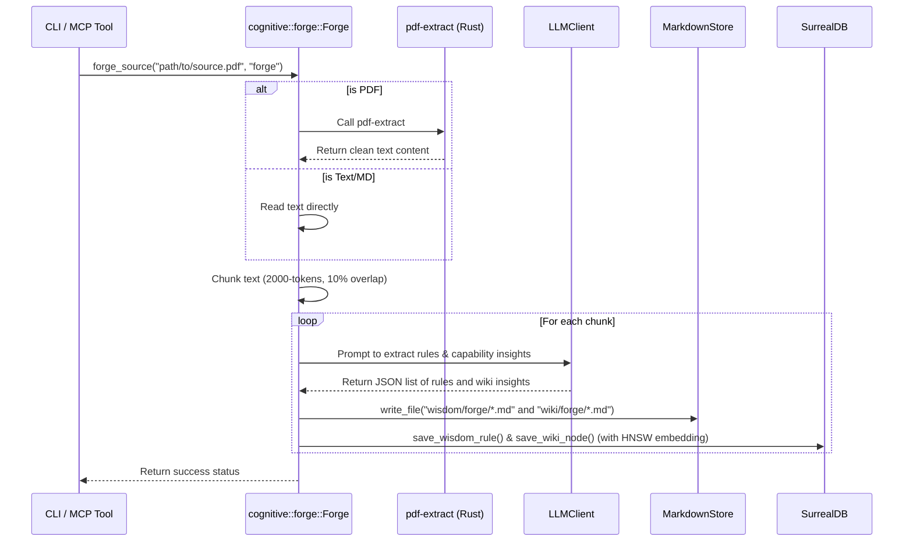

# Design

## Overview
This design specifies the implementation of:
1.  **Short Term Memory (STM)**: Exposing dynamic key-value storage indexed by `session_id`. Stored in SurrealDB and dual-written to `.handoffs/stm_<session_id>.json`. It implements automatic cleanup by deleting the local file on task session completion.
2.  **Mythrax Forge**: An ingestion service (`cognitive::forge::Forge`) that processes high-fidelity references into clean Markdown text (with PDF support using the pure-Rust `pdf-extract` crate), chunks the text, invokes the LLM to extract structured `WisdomRule`s and `WikiNode`s, and persists them into the vault and SurrealDB.
3.  **Handoff Skill Consolidation**: Merging the global `agent-handoff` skill rules directly into the project-scoped `mythrax` skill. Contracts enforce strict AST-symbolic references (classes, functions, line-anchored links) inside `.handoffs/handoff_<task_id>.md`.
4.  **Lean Skill Paradigm**: Formulating and enforcing a design standard where `SKILL.md` contains only core declarative constraints. Long references, code examples, and playbooks are moved to subdirectories (e.g. `examples/`, `references/`) and ingested into SurrealDB via the Forge, allowing the agent to load them contextually on-demand.

## Execution Flow

### 1. Short Term Memory (STM)


### 2. Mythrax Forge Ingestion


## Interfaces

### MCP Tools
New tools added to the MCP router (`mcp.rs`):
-   `put_short_term`:
    -   Arguments: `session_id: String`, `key: String`, `value: String`
-   `get_short_term`:
    -   Arguments: `session_id: String`, `key: Option<String>`
-   `clear_short_term`:
    -   Arguments: `session_id: String`
-   `forge_source`:
    -   Arguments: `source_path: String`, `scope: Option<String>`

### CLI Subcommands
New CLI subcommands in `cli.rs`:
-   `mythrax-core stm put <session_id> <key> <value>`
-   `mythrax-core stm get <session_id> [<key>]`
-   `mythrax-core stm clear <session_id>`
-   `mythrax-core forge <source_path> [--scope <scope>]`

## Data and State

### SurrealDB Schema Update
We will define the `short_term_memory` table schema in `db/schema.rs`:
```sql
    DEFINE TABLE IF NOT EXISTS short_term_memory SCHEMAFULL;
    DEFINE FIELD IF NOT EXISTS session_id ON short_term_memory TYPE string;
    DEFINE FIELD IF NOT EXISTS key ON short_term_memory TYPE string;
    DEFINE FIELD IF NOT EXISTS value ON short_term_memory TYPE string;
    DEFINE FIELD IF NOT EXISTS updated_at ON short_term_memory TYPE datetime DEFAULT time::now();
    DEFINE INDEX IF NOT EXISTS stm_session_key ON short_term_memory FIELDS [session_id, key] UNIQUE;
```

### StorageBackend Trait Additions
Add the following methods to `StorageBackend` (`db/backend.rs`):
```rust
    async fn save_stm(&self, session_id: &str, key: &str, value: &str) -> Result<()>;
    async fn get_stm(&self, session_id: &str, key: Option<&str>) -> Result<std::collections::HashMap<String, String>>;
    async fn clear_stm(&self, session_id: &str) -> Result<()>;
```

### Local JSON Dual-Write Format
`.handoffs/stm_<session_id>.json` structure:
```json
{
  "active_errors": "Compilation failed at main.rs:34",
  "touched_symbols": "ApiState, save_handoff_handler",
  "mock_config_active": "true"
}
```

## Error Handling
-   **PDF Extraction Failures**: If a PDF file cannot be parsed by the `pdf-extract` crate (due to password protection, scanning without text layer, or corruption), a detailed error is logged and the forge task terminates gracefully with a user-facing explanation.
-   **STM Concurrency**: SurrealDB's transaction boundaries ensure thread safety. Local file dual-writes will use atomic write-and-rename semantics to prevent corrupted JSON.
-   **STM Ephemeral Cleanup**: The `clear_short_term` tool/CLI command will delete both the records in SurrealDB and the local `.handoffs/stm_<session_id>.json` file from disk. This prevents orphaned JSON files from building up in the workspace.
-   **Handoff AST Verification**: Handoff contracts will be parsed to ensure the `Scoped Target Context` section contains valid file URLs and precise symbol references (e.g. `[ClassName](file:///path/to/file#L10-L20)`), returning a validation warning if missing.
-   **Scheduled Handoff File Cleanup**: The background daemon's daily loop (in `src/main.rs`) will scan SurrealDB for handoff records where `status = "COMPLETED"` or `status = "FAILED"`. If a record is older than 7 days, the daemon will:
    1. Resolve the path of `handoff_file_path` and delete the handoff markdown files (`handoff_*.md`) and associated `stm_*.json` files.
    2. Execute a SurrealDB delete query to purge the handoff record from the database.

## Safety Boundaries
-   **Secrets Filtering**: Any value written to STM files or Obsidian vault files is put through `SecretFilter::clean()` to ensure API keys or credentials do not leak.
-   **Context Chunk Limits**: Forge blocks are bounded at 2000 tokens to prevent out-of-memory or context-overflow exceptions in the LLM completions.

## Observability
-   Forge outputs are logged to stdout/stderr.
-   STM mutations are logged at `DEBUG` levels to avoid chat noise.
