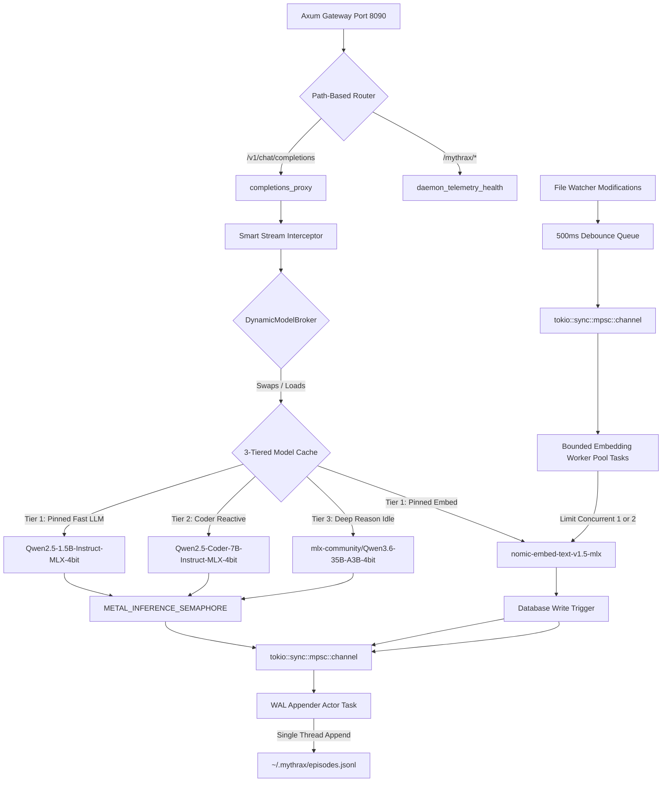

# Design: Mythrax 2.0

## Overview
Mythrax 2.0 refactors the memory daemon into a self-contained, high-performance sidecar intelligence. It unifies the model execution and embedding layers on Apple Silicon (via native MLX), implements hybrid search with Reciprocal Rank Fusion and soft candidate thresholds, automates clustering calibration, and moves agentic orchestration complexity into a stateful, compiler-guided HTR TDD tree search. 

It is written in 100% pure Rust, utilizing SurrealKV for database persistence, a thread-safe channel-based Write-Ahead Log (WAL) actor for durable episodic memory backups, a background embedding worker pool, and a single-port Axum gateway.

---

## Execution Flow



### 1. Daemon Bootstrapping & Self-Healing
On startup, the daemon:
1.  **Stale Lock Recovery & PID Name Guard:** Checks the PID in `~/.mythrax/daemon.pid`. To prevent PID recycling issues (where an unrelated process holds the recycled PID of a crashed daemon), the boot check verifies both that the PID is active and that the process **name** running at that PID is indeed `mythrax` or `mythrax-core`. If it is inactive or a different process, it purges `daemon.pid` and `daemon.lock` to prevent SurrealKV lock contention.
2.  **OS File Descriptor Expansion:** Programmatically queries the soft file descriptor limit and raises it to the system's maximum hard limit (typically 10,240 on macOS) using the `rlimit` crate.
3.  **Token Persistence & Owners-Only Permissions:** Reads `~/.mythrax/token` on boot. If the file exists and is valid, the daemon loads and reuses the token to preserve session continuity for active child processes if the daemon restarts. Only generate a new token if the file is missing or invalid, writing it with strict Unix file permissions (`0600` / owner read-write only).
4.  **Single-Port Gateway:** Binds a single Axum server to port 8090. If blocked, it dynamically scans for the next available port, binds to it, and writes the active port to `~/.mythrax/config.json`.
5.  **Database Initialization (SurrealKV):** Initializes the persistent database using the pure-Rust SurrealKV engine. 
    *   *Fresh Database Marker & Robust WAL Recovery:* If the SurrealKV directory is initialized fresh, the daemon detects the absence of a `.initialized` marker file. It triggers the background WAL recovery replay (reading `~/.mythrax/episodes.jsonl` line-by-line). If any line is malformed or contains invalid JSON, the parser **logs a warning, skips that single line, and continues replaying the remaining records** rather than aborting. It then writes the `.initialized` marker file. If the database is already initialized, the WAL replay is bypassed.
    *   *Self-Healing Recovery:* If SurrealKV initialization fails due to file corruption or format mismatch, the daemon automatically renames the corrupted directory to a backup folder, starts a fresh SurrealKV instance, re-indexes Markdown files, and replays the JSONL WAL log file, preventing data loss.
6.  **Schema Migration Verification:** Checks the `schema_version` key inside SurrealKV on boot. If a major mismatch is detected against the current binary, it runs versioned SQL migration scripts or triggers an automated backup-and-reindex.
7.  **DBSCAN Epsilon Calibration & Override:** If the database contains $\ge 100$ embeddings, it runs the k-distance elbow method to automatically calibrate DBSCAN $\epsilon$. If embeddings are $<100$, it falls back to a default mapped to the active model family. Users can override the fallback epsilon via `mythrax.yaml` (`embeddings.default_epsilon`).
8.  **Memory Pressure Monitor & Dynamic Swap Eviction:** Spawns a background thread running every 10 seconds to monitor host memory pressure (via `sysctl vm.swapusage` or host statistics). To protect host stability, the active swap monitoring thresholds dynamically adjust based on the loaded model. For the default 7B model, exceeding 3.0 GB of active swap triggers VRAM cache purging and task suspension. For the 35B model, the threshold dynamically expands to 6.0 GB to accommodate the larger VRAM footprint without triggering premature evictions on systems with sufficient resources.

### 2. Zero-Friction CLI Redirection (`mythrax exec`)
When the developer runs `mythrax exec -- <command>`:
1.  **Bootstrap Sync Gate:** The CLI polls the daemon's `/mythrax/health` endpoint on port 8090 with a 200ms interval, waiting for a `200 OK` health status before proceeding.
2.  **Direct Execution (No Shell Wrapper):** Spawns the executable directly using `std::process::Command` (passing arguments as separate array elements), eliminating command injection vulnerabilities. It injects:
    *   `OPENAI_BASE_URL=http://127.0.0.1:8090/v1`
    *   `OPENAI_API_KEY=<persistent_local_api_key>`
    *   `OLLAMA_HOST=http://127.0.0.1:8090`
    *   `MYTHRAX_SESSION_ID=<uuid>`
3.  **Signal Forwarding:** Captures `SIGINT` (Ctrl+C) and `SIGTERM` and forwards them to the child process PID.
4.  **Active Session Registration:** Registers the child process PID and session ID in the daemon's SurrealKV STM cache.

### 3. Stateful HTR TDD Tree Search Execution
When a task handoff is executed:
1.  The TDD engine operates as a state machine inside the Cognitive Hypothesis Tree Search (HTR) pipeline.
2.  **State 1: Test Generation:** The active local LLM (e.g., Qwen-7B or Qwen-35B) generates *only* the unit test, constrained by a GBNF grammar.
3.  **State 2: Compile Failure Check:** The engine runs `cargo test --offline` in a dynamically isolated target directory (`CARGO_TARGET_DIR=target/mythrax_htr_<node_id>/`) to avoid build lock and global cargo registry lock contention. It verifies that the test compiles and fails.
4.  **State 3: Implementation:** The engine feeds the failing test to the model, which generates the implementation code.
5.  **State 4: Verification:** The engine runs the test suite in the isolated directory. If it passes, the node is marked `success` and backpropagated; if it fails, a new node is spawned to fix the bug.
6.  **Escalation:** If the loop fails 3-5 times, the engine halts, compiles a detailed `Diagnostic Post-Mortem` containing code attempts and compiler logs, and returns a failure state to the cloud orchestrator (Antigravity).

### 4. Smart Stream Interception
When the agent sends a chat completion request to the proxy:
1.  The Axum gateway intercepts the streaming response.
2.  It buffers the first line of the model's SSE completion stream.
3.  If the model correctly outputs the `Execution Check` block, it flushes the buffer immediately.
4.  If the check is missing or malformed, the gateway silently generates and prepends a valid `Execution Check` block, formatting it as valid, OpenAI-compliant SSE JSON stream chunks (`choices[0].delta.content`) to prevent client SDK crashes, and then flushes the model's actual response.

### 5. Active Memory Forgetting & Compaction (Tier 3 Dreaming Scheduler)
During the background idle-gated dreaming cycle (triggered after 10 minutes of user inactivity):
1.  **Tier 3 Swapping Gate:** The daemon suspends background watcher events, drops any active Tier 2 model reference, triggers explicit Metal cache eviction, and loads the **Tier 3 (35B)** high-reasoning model.
2.  **Compaction:** The compactor queries all episodic nodes where the Ebbinghaus decay factor $e^{-\lambda t}$ is $<0.15$.
3.  **Deep Synthesis:** It groups these decayed nodes by scope and calls the Tier 3 model to summarize these raw episodes into a "Historical Digest" note.
4.  **Safe Local Archive:** The compactor writes the digest to `~/.mythrax/archive/digest_YYYY_QX.md`, keeping the watched vault directory untouched.
5.  **Cleanup & Eviction:** It flags the original episodes as `status: 'archived'` in SurrealKV, moves raw files to cold storage, and prunes `wiki_node_history` older than 30 days.
6.  **WAL Compaction Cycle:** It reads `episodes.jsonl`, retains only the latest version of each unique episode ID, and rewrites a compacted, slimmed-down WAL file.
7.  **VRAM Unload & Metal Cache Purge:** Immediately upon completion (or if user activity is detected), the broker drops the Tier 3 strong reference, unloads the model, and calls `mlxrs::metal::clear_cache()` to free all physical VRAM before the developer returns, preventing interactive lag.

---

## Interfaces & API Contracts

### 1. Inference Engine Trait
Exposes local MLX execution, ONNX execution, and external API gateways:
```rust
#[async_trait::async_trait]
pub trait InferenceEngine: Send + Sync {
    async fn generate(&self, prompt: &str, system_instruction: Option<&str>) -> Result<String>;
    async fn generate_stream(&self, prompt: &str, system_instruction: Option<&str>) -> Result<BoxStream<'static, String>>;
    async fn tokenize(&self, text: &str) -> Result<Vec<u32>>;
}
```

### 2. Single-Port Gateway Endpoints (Axum Port 8090)
*   `POST /v1/chat/completions`: OpenAI-compatible completions proxy (with prompt hydration, Bearer key validation, and SSE stream interception).
*   `POST /api/chat` & `POST /api/generate`: Ollama-compatible endpoints.
*   `GET /mythrax/telemetry`: Exposes anonymized, local performance metrics (tokens/sec, RAG latency, memory allocations).
*   `GET /mythrax/jobs/:id`: Polling status endpoint for background batch tasks.
*   `GET /mythrax/health`: Lightweight daemon health check.
*   `GET /mythrax/archive`: Exposes the local archive digests to the client Obsidian plugin.

---

## Database Schema & Time-Travel History
To enable robust point-in-time temporal queries, the database schema defines a dedicated history table and database event triggers inside `src/db/schema.rs`:

```surrealql
-- Primary wiki table
DEFINE TABLE wiki_node SCHEMAFULL;
DEFINE FIELD title ON wiki_node TYPE string;
DEFINE FIELD content ON wiki_node TYPE string;
DEFINE FIELD updated_at ON wiki_node TYPE datetime DEFAULT time::now();

-- History table for time-travel
DEFINE TABLE wiki_node_history SCHEMAFULL;
DEFINE FIELD node_id ON wiki_node_history TYPE string;
DEFINE FIELD title ON wiki_node_history TYPE string;
DEFINE FIELD content ON wiki_node_history TYPE string;
DEFINE FIELD recorded_at ON wiki_node_history TYPE datetime DEFAULT time::now();

-- Event trigger to automatically archive versions on update
DEFINE EVENT wiki_node_update_history ON TABLE wiki_node WHEN $event = "UPDATE" OR $event = "CREATE" THEN (
    CREATE wiki_node_history SET
        node_id = $after.id,
        title = $after.title,
        content = $after.content,
        recorded_at = time::now()
);
```

---

## Configuration Overrides & Tuning

To prevent hardcoded limitations and enable advanced users to maximize throughput on powerful hardware, the daemon exposes the following configurable parameters in `~/.mythrax/config.json` (or `mythrax.yaml`):

```json
{
  "models": {
    "embeddings": "mlx-community/nomic-embed-text-v1.5-mlx",
    "tier1_fast_llm": "mlx-community/Qwen2.5-1.5B-Instruct-MLX-4bit",
    "tier2_coder_llm": "mlx-community/Qwen2.5-Coder-7B-Instruct-MLX-4bit",
    "tier3_reasoning_llm": "mlx-community/Qwen3.6-35B-A3B-4bit",
    "max_context_window": 16384
  },
  "memory": {
    "disable_swap_monitor": false,
    "swap_threshold_tier1_gb": 2.0,
    "swap_threshold_tier2_gb": 3.0,
    "swap_threshold_tier3_gb": 6.0,
    "metal_cache_limit_gb": 0.0
  },
  "embeddings": {
    "max_concurrent_tasks": 2,
    "default_epsilon": 0.55
  },
  "htr": {
    "tdd_max_attempts": 5,
    "preemption_timeout_seconds": 2.0
  },
  "compaction": {
    "decay_threshold": 0.15,
    "history_pruning_days": 30,
    "wal_compaction_hours": 24
  }
}
```

*   **Memory Eviction Overrides:** If `memory.disable_swap_monitor` is set to `true`, the active swap monitoring thread is completely deactivated. Users with large unified memory pools (e.g., 64GB to 192GB) can load all three model tiers in VRAM concurrently without triggering swap evictions.
*   **Context Window Expansion:** The `model.max_context_window` parameter allows expanding the completions context window beyond the default 16k tokens to support larger files.
*   **Embedding Concurrency Scaling:** In `watcher.rs`, the process-global bounded worker pool concurrency is determined by `embeddings.max_concurrent_tasks`. Advanced users can increase this to 8 or 16 for high-speed indexing on high-core GPUs.
*   **HTR TDD Loop Customization:** The maximum number of failed compiler attempts before escalating is tuned via `htr.tdd_max_attempts`, and the preemption token loop timeout is configured via `htr.preemption_timeout_seconds`.
*   **Temporal Compaction Tuning:** Compaction thresholds, history log pruning cycles, and transaction log compaction intervals are fully configured under the `compaction` settings.

---

## Security, Concurrency & Workload Boundaries
*   **Persistent Local Token:** Generates a unique API key on boot only if `~/.mythrax/token` is missing or invalid. Reuses the token if valid, preserving active child process sessions. Written with strict Unix permissions (`0600`). All endpoints require this token in the `Authorization: Bearer <key>` header.
*   **ONNX Dynamic Library Linkage (`ort`):** Non-macOS compilation enables the `download-binaries` feature in `Cargo.toml` to automatically download the pre-compiled ONNX Runtime shared libraries, bypassing manual compiler linking setups.
*   **Thread-Safe Async WAL Actor & Compaction:** All save operations write to an asynchronous `tokio::sync::mpsc::channel`. A single background tokio task reads from this channel and appends to `episodes.jsonl` sequentially. Malformed lines are skipped during recovery. Compaction occurs every 24 hours.
*   **Split GPU Semaphores:** 
    - `METAL_INFERENCE_SEMAPHORE` (capacity 1): Serializes completions.
    - `METAL_EMBEDDING_SEMAPHORE` (capacity 1): Serializes embeddings.
*   **Upstream Watcher Filtering, 500ms Coalescing & Bounded Pool:** Filters out `.trash`, `target`, `.git`, and `.mythrax` paths inside the notify callback *before* sending events to the channel, protecting the channel from congestion. Spawns a **500ms debouncing write-behind queue** inside `watcher.rs` to coalesce high-frequency edit events into a single task. To prevent massive batch edit storms (e.g. git checkouts or bulk scripts) from saturating the threads, all background embedding tasks are routed through a **bounded process-global channel (worker pool)** that limits concurrent background embedding generations to exactly 1 or 2 tasks.
*   **Symlink Loop & FD Guards:** Explicitly disables following symlinks in `watcher.rs` and restricts watch depth to a maximum of 10 levels and 50,000 files.
*   **Token-Level Preemption:** Checks the cooperative `CancellationToken` inside the FFI token-generation loop after every single token, enforcing a 2-second hard preemption timeout.
*   **Canonicalized Pre-Download Disk Check:** Target download paths are canonicalized (`fs::canonicalize`) prior to calling `libc::statfs` on macOS, verifying a minimum of 10.0 GB of free space on the correct partition.
*   **Pre-Inference Shader Warm-up & Cache Panic Fallback:** Immediately after model swap, the broker executes a single-token dummy inference step in the background. Wrap this FFI call in safe error handling, logging a warning and falling back to CPU-only execution if Metal shader cache corruption occurs.
*   **Rolling Log Appender:** Integrates `tracing-appender` to roll `daemon.log` at 50MB, maintaining a maximum of 3 historical backups.
*   **Graceful Shutdown Timeout:** Wraps the shutdown sequence in a 5-second `tokio::time::timeout`, forcing exit if it hangs.
*   **CI/CD Compilation Guard:** Annotates all Metal/MLX-dependent integration tests with `#[cfg(feature = "mlx")]` to ensure they compile and are skipped on non-macOS CI/CD runners.
