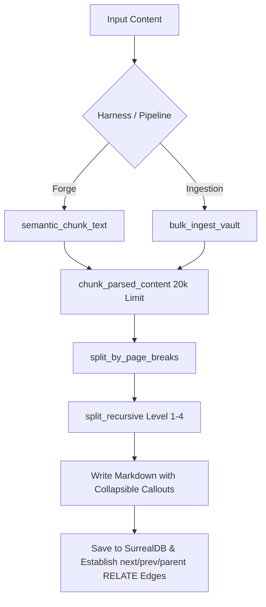

# Design: Page-Level Chunking & Graph Linking (Updated)

## Overview
This design unifies the Document Forging (`Forge`) and Transcript Ingestion pipelines under a single, highly performant, page-level chunking model. It guarantees clean, boundary-aligned splits at 20,000 characters, creates human-readable Obsidian collapsible navigation callouts, and establishes sequential and hierarchical links in SurrealDB.

---

## Execution Flow



---

## Interfaces & AST Function Headers

### 1. Unified Hierarchical Chunker (`mythrax-core/src/vault/ingestion.rs`)

We will replace the current implementation of `chunk_parsed_content` and add the following private helper functions in `ingestion.rs`:

```rust
/// Unified entry point to chunk parsed content at page, section, paragraph,
/// and line boundaries up to a specified character limit.
pub fn chunk_parsed_content(content: &str, limit: usize) -> Vec<String> {
    if content.len() <= limit {
        return vec![content.to_string()];
    }
    
    // 1. Split by page breaks (Level 0 - hard boundaries, never grouped)
    let pages = split_by_page_breaks(content);
    let mut all_chunks = Vec::new();
    for page in pages {
        if !page.trim().is_empty() {
            all_chunks.extend(split_recursive(&page, 1, limit));
        }
    }
    all_chunks
}

/// Splitting Level 0: Frontmatter-aware page break splitting.
/// Enclosing frontmatter '---' markers at the start of the file are ignored.
/// Treats any other '\f', '---', '***', or '___' lines as page breaks.
fn split_by_page_breaks(text: &str) -> Vec<String>;

/// Recursive splitting and grouping driver applying Level 1-4.
/// It performs context-aware joining by grouping sub-chunks at each level
/// using that level's specific delimiter (e.g. \n\n for sections/paragraphs, \n for lines, ' ' for words).
fn split_recursive(text: &str, level: usize, max_chars: usize) -> Vec<String> {
    if text.len() <= max_chars {
        return vec![text.to_string()];
    }

    // Determine delimiter and segments based on level
    let (delimiter, segments) = match level {
        1 => {
            // Level 1: Sections (Markdown headers)
            ("\n\n", split_by_sections(text))
        }
        2 => {
            // Level 2: Paragraphs (\n\n)
            ("\n\n", split_by_paragraphs(text))
        }
        3 => {
            // Level 3: Lines (\n)
            ("\n", split_by_lines(text))
        }
        _ => {
            // Level 4: Words (spaces)
            (" ", split_by_words(text))
        }
    };

    // If splitting at this level yielded only 1 segment (could not divide further),
    // immediately fall back to the next level of recursion.
    if segments.len() == 1 && segments[0] == text {
        if level >= 4 {
            // Hard fallback: split by character limit
            return split_by_chars(text, max_chars);
        } else {
            return split_recursive(text, level + 1, max_chars);
        }
    }

    // Recursively process each segment
    let mut sub_chunks = Vec::new();
    for seg in segments {
        sub_chunks.extend(split_recursive(&seg, level + 1, max_chars));
    }

    // Group the sub-chunks using the level's specific delimiter (context-aware joining)
    group_sub_chunks(sub_chunks, delimiter, max_chars)
}

/// Splitting Level 1: Split before markdown headers (lines starting with '# ').
fn split_by_sections(text: &str) -> Vec<String>;

/// Splitting Level 2: Split by paragraphs (\n\n).
fn split_by_paragraphs(text: &str) -> Vec<String>;

/// Splitting Level 3: Split by lines (\n).
fn split_by_lines(text: &str) -> Vec<String>;

/// Splitting Level 4: Split by whitespace/words.
fn split_by_words(text: &str) -> Vec<String>;

/// Hard Fallback: Split a string directly by characters to fit the limit.
fn split_by_chars(text: &str, max_chars: usize) -> Vec<String>;

/// Groups sub-chunks together using a specific delimiter up to the max_chars limit.
fn group_sub_chunks(sub_chunks: Vec<String>, delimiter: &str, max_chars: usize) -> Vec<String>;
```

---

### 2. Episode Ingestion Refactoring (`mythrax-core/src/vault/ingestion.rs`)

We will modify `bulk_ingest_vault` (specifically the `antigravity` log processing block):

```rust
pub async fn bulk_ingest_vault(
    vault_root: &Path,
    source_dir: &Path,
    harness_type: &str,
    scope: &str,
    db: &dyn StorageBackend,
) -> Result<(usize, Vec<String>)>
```

#### Shared UUID and File Naming
```rust
let shared_uuid = &uuid::Uuid::new_v4().to_string()[..8];
// Single-part: episodes/antigravity_{dir_name}_{shared_uuid}.md
// Multi-part: episodes/antigravity_{dir_name}_part{idx}_{shared_uuid}.md
```

#### Obsidian Collapsible Callout Insertion
At the bottom of each chunk's markdown content, append:
```rust
let mut navigation_callout = String::new();
navigation_callout.push_str("\n\n> [!INFO] Navigation\n");
navigation_callout.push_str(&format!("> - **Parent**: [[episodes/antigravity_{}_{}|antigravity_{}]]\n", dir_name, shared_uuid, dir_name));
if chunk_idx > 0 {
    let prev_title = format!("antigravity_{}_part{}", dir_name, chunk_idx);
    let prev_rel_path = format!("episodes/antigravity_{}_part{}_{}.md", dir_name, chunk_idx, shared_uuid);
    let prev_link = prev_rel_path.strip_suffix(".md").unwrap_or(&prev_rel_path);
    navigation_callout.push_str(&format!("> - **Prev**: [[{}|{}]]\n", prev_link, prev_title));
}
if chunk_idx + 1 < total_chunks {
    let next_title = format!("antigravity_{}_part{}", dir_name, chunk_idx + 2);
    let next_rel_path = format!("episodes/antigravity_{}_part{}_{}.md", dir_name, chunk_idx + 2, shared_uuid);
    let next_link = next_rel_path.strip_suffix(".md").unwrap_or(&next_rel_path);
    navigation_callout.push_str(&format!("> - **Next**: [[{}|{}]]\n", next_link, next_title));
}
```

#### SurrealDB Sequential and Parent Linking
```rust
if let Some(surreal) = db.as_any().downcast_ref::<crate::db::SurrealBackend>() {
    // 1. Establish parent-child links for all parts to the parent episode
    let parent_thing = crate::db::parse_record_id(&parent_saved_id)?;
    let child_thing = crate::db::parse_record_id(&part_saved_id)?;
    let query_parent = "RELATE $child_thing -> relates_to -> $parent_thing UNIQUE CONTENT { relation: 'parent', created_at: time::now() };";
    
    // 2. Establish next/prev links between adjacent parts
    let part_n_thing = crate::db::parse_record_id(&part_n_id)?;
    let part_n_plus_1_thing = crate::db::parse_record_id(&part_n_plus_1_id)?;
    let query_next = "RELATE $part_n -> relates_to -> $part_n_plus_1 UNIQUE CONTENT { relation: 'next', created_at: time::now() };";
    let query_prev = "RELATE $part_n_plus_1 -> relates_to -> $part_n UNIQUE CONTENT { relation: 'prev', created_at: time::now() };";
}
```

---

### 3. Document Forging Refactoring (`mythrax-core/src/cognitive/forge.rs`)

We will rewrite `semantic_chunk_text` and update `ingest_document`:

```rust
/// Delegates directly to the unified character-based chunker with a 20k limit.
pub fn semantic_chunk_text(&self, content: &str) -> Vec<String> {
    crate::vault::ingestion::chunk_parsed_content(content, 20_000)
}
```

#### Collapsible Callout Insertion in Forge Chunks (`ingest_document`)
At the bottom of each chunk's markdown content, append:
```rust
let mut navigation_callout = String::new();
navigation_callout.push_str("\n\n> [!INFO] Navigation\n");
navigation_callout.push_str(&format!("> - **Parent**: [[{}]]\n", _source_name));
if idx > 0 {
    let prev_chunk_name = format!("{} - Chunk {}", _source_name, idx);
    navigation_callout.push_str(&format!("> - **Prev**: [[{}]]\n", prev_chunk_name));
}
if idx + 1 < chunks.len() {
    let next_chunk_name = format!("{} - Chunk {}", _source_name, idx + 2);
    navigation_callout.push_str(&format!("> - **Next**: [[{}]]\n", next_chunk_name));
}
```

#### Parent Document Chunks Index (`ingest_document`)
At the bottom of the parent index document, append:
```rust
let mut parent_md = format!(...);
parent_md.push_str("\n\n## Chunks\n");
for (idx, _) in chunks.iter().enumerate() {
    let chunk_name = format!("{} - Chunk {}", _source_name, idx + 1);
    parent_md.push_str(&format!("- [[{}]]\n", chunk_name));
}
```

---

## Data & State Management
- **SurrealDB Schema Alignment**: Uses the existing `relates_to` table schema in `mythrax-core/src/db/schema.rs`.
- **Idempotency**: Saving nodes using `save_episode` and `save_wiki_node` remains fully idempotent. Wiping database/vault files before re-ingestion guarantees no orphaned nodes or duplicate parts.

---

## Safety Boundaries & Error Handling
1. **Downcast Protection**: All `db.as_any().downcast_ref::<SurrealBackend>()` calls must be checked. If they return `None` (e.g., during testing with mock backends), the system must skip SurrealDB relations and log a trace message instead of panicking.
2. **Infinite Recursion Protection**: `split_recursive` uses a monotonically increasing `level` parameter. If `level > 4`, it falls back directly to character-based splitting, guaranteeing termination.
3. **Empty Text Guard**: If the input text is empty, the chunker must return an empty vector or a vector with a single empty string, preventing empty-slice panic vectors.
