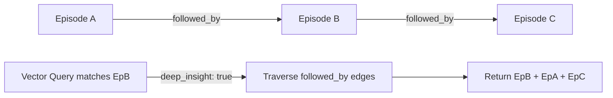

# Design: Phase 1 Foundations (v0.9.x)

This document outlines the technical design for the three Phase 1 features:
1.  **1.1 Zero-Config Automatic Scope Switching**
2.  **1.2 Temporal Trajectory Graphing & Sequential Replay**
3.  **1.3 Zero-Friction Automatic Failure Diagnostics**

---

## 1.1 Zero-Config Automatic Scope Switching

### Overview
Automatic scope switching dynamically detects the project context from the filesystem or process environment and scopes all semantic memory searches and wisdom lookups to the active project plus the `"general"` scope.

### Execution Flow
```
Process/IDE Action ──► Resolve Active Path ──► Find Root (with .git/.agents/markers) ──► Extract Folder Name (Scope)
                                                                                                    │
                                                                                                    ▼
Search Request ◄───────────────────────────────────────────────────────────────────────── Inject Scope Filter
```

### Detailed Mechanics
1.  **Scope Resolver Utility**: Implement a helper function `resolve_active_scope() -> String` in `mythrax-core/src/db/backend.rs`:
    *   Read the environment variable `MYTHRAX_WORKSPACE_ROOT` if set.
    *   Otherwise, read the current directory of the process (`std::env::current_dir()`).
    *   Traverse up parent directories until a boundary marker is found: a folder containing `.git`, `.agents`, `Cargo.toml`, or `package.json`.
    *   If a marker is found, extract the leaf directory name, **normalize it to lowercase and strip all non-alphanumeric separators** (e.g. `mythrax-core` and `mythrax_core` both normalize to `"mythraxcore"`), and use it as the active scope.
    *   If no marker is found, default to `"general"`.
2.  **Database Search Integration**:
    *   In `SurrealBackend::search` and `SurrealBackend::get_wisdom`, if the `scope` parameter is `None` (not explicitly provided by the caller):
        *   Invoke `resolve_active_scope()`.
        *   Apply the scope filter so the database query matches only the resolved active scope and `"general"` (e.g. `WHERE scope IN [$active_scope, "general"]`).
    *   > [!IMPORTANT]
    *   > **SurrealDB Variable Collision Guardrail**: In all SurrealQL queries, never bind variables using the name `$scope` (which is a protected SurrealDB session variable and causes runtime query errors). Always bind project or filter scopes using `$target_scope` or `$active_scope`. This matches the database fixes established during the HTR generalization cycle.

---

## 1.2 Temporal Trajectory Graphing & Sequential Replay

### Overview
Extend the database schema to support sequential linking of episodic events and versioning of wisdom rules. During deep search, traverse the temporal graph to retrieve step-by-step history.



### Data and State
1.  **Schema Definition** (`mythrax-core/src/db/schema.rs`):
    *   Define relationship tables:
        ```sql
        DEFINE TABLE IF NOT EXISTS followed_by SCHEMAFULL TYPE RELATION IN episode OUT episode;
        DEFINE FIELD IF NOT EXISTS duration ON followed_by TYPE option<duration>;
        DEFINE FIELD IF NOT EXISTS created_at ON followed_by TYPE datetime DEFAULT time::now();

        DEFINE TABLE IF NOT EXISTS superseded_by SCHEMAFULL TYPE RELATION IN wisdom OUT wisdom;
        DEFINE FIELD IF NOT EXISTS reason ON superseded_by TYPE option<string>;
        DEFINE FIELD IF NOT EXISTS created_at ON superseded_by TYPE datetime DEFAULT time::now();
        ```
2.  **Save/Ingestion Chain**:
    *   Update the `save_episode` method signature and the `save_episode` MCP tool input schema to accept an optional `session_id: Option<String>` and `task_id: Option<String>`.
    *   If `session_id` is provided:
        1.  Determine the key under which to track the prior episode. To ensure **parallel subagent and branch run isolation**, store the last episode ID under the key `_last_episode_id_<task_id>` in STM if a `task_id` is provided, falling back to a session-level key `_last_episode_id` otherwise.
        2.  Check `short_term_memory` for the tracking key where `session_id = $session_id`.
        3.  If found, run a SurrealQL query to create the edge:
            `RELATE $last_episode_id->followed_by->$new_episode_id;`
        4.  Upsert the `short_term_memory` table, setting the tracking key to `$new_episode_id`.
3.  **Retrieval Chain**:
    *   In `SurrealBackend::search`, if `deep_insight` is `true` and `include_episodes` is `true`:
        *   Modify the SQL query to fetch adjacent temporal nodes:
            ```sql
            SELECT id, title, content, embedding, vault_path,
                   (SELECT VALUE utility_score FROM metrics WHERE target_id = $parent.id LIMIT 1)[0] AS utility,
                   <-followed_by<-episode.* AS prev_episodes,
                   ->followed_by->episode.* AS next_episodes
            FROM episode ...
            ```
        *   Hydrate these adjacent nodes into the `related_nodes` array of the matching `SearchResult` to return a chronological sequence.

---

## 1.3 Zero-Friction Automatic Failure Diagnostics

### Overview
Implement an automatic, high-speed, local diagnostic hook that matches test or shell execution failures against past resolutions, returning a clean, concise remedy instead of massive log dumps.

### Execution Flow (HTR Test Failure)
```
HTR Test Fails ──► Intercept stderr/stdout ──► Regex Extract Error Code (e.g. E0432)
                                                              │
                                                              ▼
Log Return decorated with Remedy ◄── Fetch Remedy ◄── Low-Limit Vector + Keyword Search
```

### Detailed Mechanics
1.  **Diagnostic Matcher Engine**: Implement `diagnose_error_internal(&self, stderr: &str, stdout: &str) -> Result<Option<(String, String)>>` in `SurrealBackend`:
    *   **Heuristic Regex Signatures**: Match against pre-compiled regular expressions for common compilers/frameworks:
        *   Rust: `(E\d{4})` (e.g. `E0432`, `E0277`)
        *   TypeScript/Node: `(TS\d{4})` (e.g. `TS2322`)
        *   Permissions/Credentials: `(401 Unauthorized|403 Forbidden|Permission denied|permission_denied)`
        *   Database Locks: `(lock acquisition failure|RocksDB lock|lock conflict)`
    *   **Fallback Vector/Keyword Search**: If no regex matches, **run a fast local HNSW vector search on the raw error message itself, but enforce a high similarity threshold (0.70)** to prevent returning irrelevant wisdom rules for unclassified failures, keeping search execution extremely fast and predictable.
    *   **Retrieval Constraint**: Must complete in $<5\text{ms}$ on CPU by bypassing slow LLM calls entirely.
2.  **HTR Interception Hook**:
    *   In `ArborExecutor::execute` (`mythrax-core/src/cognitive/executor.rs`), when `status.success()` is false:
        *   **Pass as Parameter**: Update the `execute` method signature of `ArborExecutor` to accept a reference to `SurrealBackend` (or its database handle) as a parameter, keeping the executor struct stateless.
        *   If the command fails, the executor calls the backend's diagnostic matcher.
        *   If a past resolution is found, the executor appends the diagnostic blocks directly to the `combined_logs` string returned to the coordinator/critic:
            ```markdown
            ---
            [MYTHRAX AUTO-DIAGNOSTIC]: A matching failure was resolved in the database.
            - Causal Explanation: [explanation]
            - Prescribed Remedy: [remedy]
            ---
            ```
3.  **MCP Tool Integration**:
    *   Expose a new JSON-RPC tool `diagnose_failure` in `McpServer::handle_request` (`mythrax-core/src/mcp.rs`).
    *   Inputs: `stdout` (string), `stderr` (string), `exit_code` (integer), `command` (string).
    *   Output: JSON containing `causal_explanation` and `prescribed_remedy` if a match is found.
    *   Update `AGENT.md` rules instructing the agent to call this tool automatically upon manual terminal command failure, keeping raw logs out of the chat prompt.

---

## Safety Boundaries & Error Handling

*   **Regex Safety**: All regular expressions will use the non-backtracking `regex` crate to prevent ReDoS (Regular Expression Denial of Service) vulnerabilities.
*   **Db Transaction Isolation**: In `save_episode` temporal updates, SurrealDB transactions or nested queries will be used to ensure the `short_term_memory` update and the `followed_by` edge creation are atomic.
*   **Failed Diagnostics Fallback**: If no past failure match is found or the search times out, the system will fail silently and return the raw command stderr without blocking execution or throwing database errors.
