# Technical Design: Phase 4 (v0.5.0) — Advanced Synthesis & Compaction

## 1. Architectural Overview & Component Interconnections

```mermaid
flowchart TD
    subgraph Compactor
        A[Load Insights from Disk] --> B[Get WikiNode IDs & Embeddings from DB]
        B --> C[Run DBSCAN on Insight Embeddings]
        C --> D{Label is None?}
        D -- No --> E[Group into Semantic Clusters]
        D -- Yes --> F[Group into Miscellaneous Cluster]
        E & F --> G[Generate Compactions via LLM]
        G --> H[Save wiki_nodes & relates_to Edges]
    end

    subgraph DreamCoordinator
        I[Load source_episodes for Insight] --> J[Calculate All-Pairs Cosine Distances]
        J --> K{Max Distance > 0.30?}
        K -- Yes --> L[Run DBSCAN on Episode Embeddings]
        L --> M[Generate Two or More Split Insights]
        M --> N[Create New Insights & relates_to Edges]
        M --> O[Delete Old Insight & relationships]
    end

    subgraph WisdomDeduplicator
        P[New Wisdom Rule generated] --> Q[Compute Embedding]
        Q --> R[Vector Search against existing Rules]
        R --> S{Similarity > 0.80?}
        S -- Yes --> T{Existing is tier: skills?}
        T -- Yes --> U[Discard New Rule, Relate Episodes to Skills Rule]
        T -- No --> V[LLM Merge/Generalize Rules]
        S -- No --> W[Save New Dynamic Rule]
    end
```

---

## 2. Implementation Specifications

### 2.1 Semantic Insight Compaction ([compactor.rs](file:///Users/keith/Documents/self-improvement-engine/mythrax-core/src/cognitive/compactor.rs))
- **Embeddings Query**:
  For each `InsightNote` returned by `load_insights`, query its DB record ID by calling `db.get_wiki_node_id_by_vault_path(&rel_path)`. Hydrate it using `db.get_memory_nodes(&[id])` to retrieve the embedding vector.
- **Clustering Step**:
  Extract the embedding slices of all insights in the scope. Call the custom `dbscan(embeddings, eps = 0.10, min_samples = 2)` function.
- **Grouping Logic**:
  - Valid clusters (label `Some(cluster_id)`) are grouped together.
  - Outliers (label `None`) are pooled into a single "Miscellaneous" chunk.
  - For each group/chunk, join the contents of the insights and call the architectural compactor LLM completion to generate the compaction summary.

### 2.2 Centroid Drift Subdivision Splits ([synthesis.rs](file:///Users/keith/Documents/self-improvement-engine/mythrax-core/src/cognitive/synthesis.rs))
- **Drift Check**:
  At the end of incremental dreaming, for each active `InsightNote` in the scope, load the full `Episode` records for all its `source_episodes` via `db.get_memory_nodes(&source_episodes)`.
- **Pairwise Distance Metric**:
  Compute the cosine distance for every pair of episode embeddings associated with the insight.
  Find the maximum pairwise distance:
  $$\text{max\_dist} = \max_{u, v \in \text{Embeddings}} \text{cosine\_distance}(u, v)$$
- **Subdivision Split**:
  If $\text{max\_dist} > 0.30$, trigger subdivision:
  1. Run `dbscan(episode_embeddings, eps = 0.08, min_samples = 2)` on the source episodes.
  2. If DBSCAN results in 2 or more distinct clusters (grouping outliers into their own cluster if necessary), generate a split.
  3. For each split cluster, construct a new `InsightNote` with a fresh title and summary generated by the LLM from those episodes.
  4. Write the new insight Markdown files to disk and save their `WikiNode`s to SurrealDB, relating them to their respective episode subset.
  5. Delete the old drifting insight file from disk and remove its `WikiNode` record and relations from the database.

### 2.3 Wisdom Rule Deduplication ([synthesis.rs](file:///Users/keith/Documents/self-improvement-engine/mythrax-core/src/cognitive/synthesis.rs))
- **Similarity Check**:
  When a new dynamic wisdom rule is formulated, call the embedder to generate its embedding vector.
  Query the database for highly similar rules.
- **Deduplication Decisions**:
  - If similarity $\le 0.80$, save it as a new `tier: "dynamic"` rule.
  - If similarity $> 0.80$ and the matched rule is `tier: "skills"`:
    Discard the new rule (since the skills rule is an immutable anchor and has absolute precedence), but relate the new rule's source episodes to the existing skills rule.
  - If similarity $> 0.80$ and the matched rule is `tier: "dynamic"` or `"forge"`:
    Call the LLM with a systems generalization prompt:
    `You are a systems synthesizer. Merge these two highly similar rules into a single generalized rule.`
    Save the generalized rule (combining the `source_episodes` lists), delete the old rule file, and remove the old rule database record and its relations.

### 2.4 Targeted Cross-Skill Harvesting ([harvest.rs](file:///Users/keith/Documents/self-improvement-engine/mythrax-core/src/cognitive/harvest.rs))
- **Description Embeddings**:
  When loading skills, call the embedder to get embedding vectors of their descriptions.
- **DBSCAN Clustering**:
  Run `dbscan(&description_embeddings, eps = 0.10, min_samples = 2)`.
- **Conflict Analysis**:
  Group the skills by their cluster labels. For each cluster containing $\ge 2$ skills, execute the cross-skill conflict LLM completion. Outlier skills (label `None`) are skipped to optimize token usage.

---

## 3. Interfaces & Data Models
No database schema changes are required. The existing `WikiNode`, `Episode`, and `WisdomRule` models are fully sufficient.

---

## 4. Safety Boundaries & Error Handling
- **DBSCAN Outlier Fallbacks**: If all insights or skills are outliers, the compactor and harvester fallback to safe behaviors (miscellaneous compaction chunk, skip skill conflict analysis).
- **Rollback on Split Failure**: If writing the split insight files or saving them to SurrealDB fails, the entire transaction is rolled back and the original insight is preserved.
