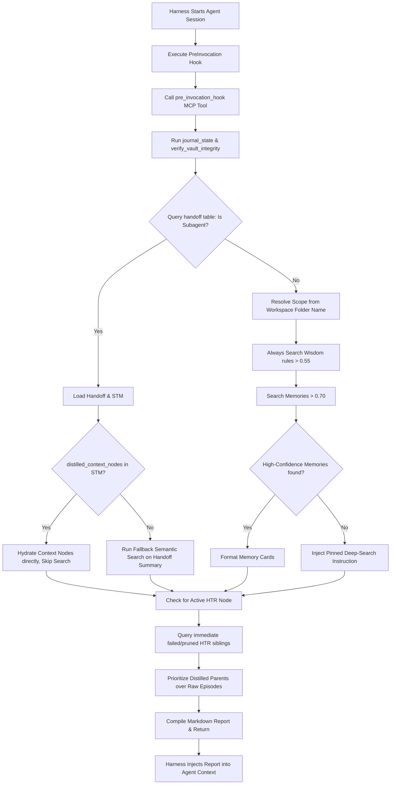

# Design: Mythrax Pre-Invocation Hook

## Overview
The pre-invocation hook is implemented as a new MCP tool `pre_invocation_hook` inside the `mythrax` MCP server. It coordinates passive workspace synchronization, detects agent session status, resolves HTR cognitive runs, and performs filtered semantic retrieval to build a unified markdown context block.



## Execution Flow

### 1. Synchronization Phase
The hook immediately triggers:
```rust
self.backend.journal_state(&self.store.vault_root, session_id.as_deref()).await?;
self.backend.verify_vault_integrity(true).await?;
```

### 2. Status & Context Resolution
- **Workspace Scope**: Resolved by taking the `file_name` of the canonicalized `workspace_path` (defaulting to the current working directory if not provided).
- **Handoff Query**: 
  ```sql
  SELECT * FROM handoff WHERE subagent_conversation_id = $session_id ORDER BY created_at DESC LIMIT 1;
  ```
- **STM Retrieval**: If the handoff exists, retrieve all STM entries using `self.backend.get_stm(session_id, None)`.

### 3. Hydration and Abstraction Priority
- **Distilled Context Hydration**: Parse `"distilled_context_nodes"` from STM (JSON array of strings). Hydrate them using `self.backend.db.select`.
- **Abstraction Priority Check**: For any retrieved `episode` record (either via hydration or semantic search):
  - Query SurrealDB for a parent distilled insight/compaction:
    ```sql
    SELECT VALUE in FROM relates_to WHERE out = $episode_id AND in INSIDE wiki_node;
    ```
  - If a parent `wiki_node` ID is returned, select its content using `self.backend.db.select` and inject the **distilled insight** instead of the episode card.
- **Episode Card Formatting**: If no parent insight is found, format the raw episode as a compact card:
  ```markdown
  - **Episode Card**: [Episode Title] (ID: `episode_id`, Scope: `scope`)
    *(Note: The full transcript of this episode is archived in Mythrax. If you need to inspect its step-by-step details, call the get_memory_nodes tool with the ID ["episode_id"].)*
  ```

### 4. Active HTR Sibling Constraints
- Resolve the active hypothesis node ID:
  - Check if any `hypothesis_node:...` ID is present in the stashed `"distilled_context_nodes"`.
  - If not, query SurrealDB for the most recent pending/active hypothesis node in the active scope:
    ```sql
    SELECT * FROM hypothesis_node WHERE scope = $scope AND status = 'pending' ORDER BY created_at DESC LIMIT 1;
    ```
- Query for immediate failed/pruned sibling nodes:
  ```sql
  SELECT * FROM hypothesis_node WHERE parent_id = $parent_id AND (status = 'failed' OR status = 'pruned');
  ```
- Format these sibling nodes into:
  ```markdown
  ### Active HTR Negative Constraints (Failed Sibling Paths)
  - **Hypothesis**: [Sibling Hypothesis] (ID: `node_id`, Score: `score`)
    - *Critic Insight*: [Sibling Critic Insight / Failure reason]
  ```

### 5. Root Agent Retrieval & Pinned Instruction Fallback
- Run `wisdom` search using `self.backend.get_wisdom(query, None, 5, 0, 0.55)`.
- Run `memories` search using `self.backend.search(query, None, false, 5, 0, 0.70, None, false, true, true)`.
- If `memories.results` is empty:
  - Inject the pinned fallback instruction:
    ```markdown
    > [!IMPORTANT]
    > **Pinned Instruction: Deep Search Recommendation**
    > No high-confidence past episodes (similarity > 0.70) were found automatically for this prompt. If this task involves complex design, refactoring, or debugging of recurring issues, you must manually run the `search_memories` tool to check for additional context before proceeding.
    ```

## Interfaces

### MCP Tool Registration
```json
{
    "name": "pre_invocation_hook",
    "description": "Pre-invocation hook to synchronize workspace state, check subagent handoffs, and retrieve distilled memory, wisdom, and active HTR sibling constraints.",
    "inputSchema": {
        "type": "object",
        "properties": {
            "session_id": { "type": "string", "description": "The active agent session/conversation ID." },
            "query": { "type": "string", "description": "The active user prompt/query." },
            "workspace_path": { "type": "string", "description": "The absolute path to the active workspace directory." }
        }
    }
}
```

## Error Handling
- **Database Connection Failure**: If the SurrealDB daemon is completely offline, the hook must catch the connection error, print a warning to `stderr`, and return a clean fallback string: `"[Mythrax Pre-Invocation Hook Warning: SurrealDB Daemon offline. Memory retrieval and state synchronization skipped.]"`. It must **never** panic or fail the agent's turn.
- **Malformed Node IDs**: If `distilled_context_nodes` contains invalid record IDs (e.g. referencing deleted nodes), skip them gracefully.

## Safety Boundaries
- **No Private Data Leak**: All stashed STM entries are sanitized by `SecretFilter` during writing, so reading them in the hook is safe.

## Observability
- Log a warning if `journal_state` or `verify_vault_integrity` fails during the synchronization phase, but allow the hook to proceed with memory retrieval.

## Tradeoffs and Rejected Alternatives
- **Rejected: Running as a shell command hook**: Running a shell script that invokes a separate binary would require starting a new process, setting up a new DB connection, and serializing the output to stdout. Integrating it directly as an MCP tool allows it to reuse the active, long-lived SurrealDB connection pool inside the `mythrax` daemon, making it sub-millisecond fast and extremely resource-efficient.
