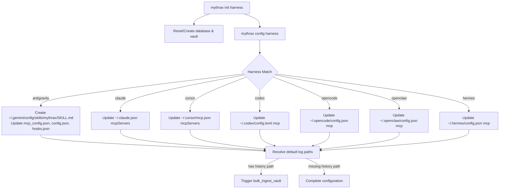

# Design - Mythrax Project Reinitialization & Harness Configuration

## Overview
This design details the connection structures for persistent RocksDB, local Nomis embeddings, and the implementation of clean initialization (`init`) and client configuration (`config`) for all 7 supported harnesses with automatic history discovery and ingestion.



## Database and Vault Bootstrapping
When `mythrax init` is invoked:
1. **RocksDB Cache**: A fresh RocksDB session folder is initialized at the configured database directory. Any existing lockfiles are cleaned, and `INIT_SCHEMA` is executed.
2. **Obsidian Vault**: The vault root directory is created. Default subfolders are written:
   - `episodes/` (for conversation transcripts)
   - `wiki/` (for RAPTOR summaries and insights)
   - `wisdom/` (for rules and causal explanations)
   - `general/` (for reports)
   - `archive/` (for quarantined notes)

## Client Configuration & History Discovery
The `config` module will handle client-specific settings dynamically. If no explicit `--source` path is specified, it will auto-locate the default history paths:

| Harness | Target MCP Configuration File | Default History Log Directory / File | Ingestion Harness Type |
|---|---|---|---|
| `antigravity` | `~/.gemini/config/mcp_config.json` | `~/.gemini/antigravity/brain/` | `"antigravity"` |
| `claude` | `~/.claude.json` | `~/.claude/projects/` | `"claude"` |
| `cursor` | `~/.cursor/mcp.json` | Cursor global state database | `"cursor"` |
| `codex` | `~/.codex/config.toml` | `~/.codex/history/` | `"codex"` |
| `opencode` | `~/.opencode/config.json` | `~/.opencode/sessions/` | `"opencode"` |
| `openclaw` | `~/.openclaw/config.json` | `~/.openclaw/history/` | `"openclaw"` |
| `hermes` | `~/.hermes/config.json` | `~/.hermes/state.db` | `"hermes"` |

If a history path exists, the CLI will spawn `bulk_ingest_vault(vault_root, history_path, type, "history", backend)` to import the data and generate Nomis embeddings.

## Programmatic CLI Subcommand Implementation
`Commands` enum in `src/cli.rs` will be updated:
```rust
pub enum Commands {
    Init {
        harness: Option<String>,
        #[arg(short, long)]
        source: Option<String>,
    },
    Config {
        harness: String,
        #[arg(short, long)]
        source: Option<String>,
    },
    // ... other commands
}
```

In `src/main.rs`, the subcommands will execute:
```rust
match command {
    Commands::Init { harness, source } => {
        // 1. Setup clean RocksDB & Vault directories
        // 2. Apply schemas
        // 3. If harness is Some, run config_harness(harness, source)
    }
    Commands::Config { harness, source } => {
        // Run config_harness(harness, source)
    }
}
```
