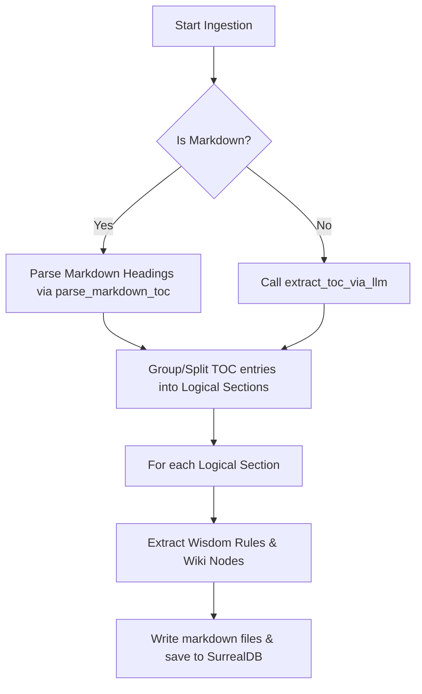

# Spec-Driven Development: TOC-Driven Section Splitting (Task 2)

## 1. Clarify

### Restated Request
Refactor the document ingestion pipeline (`Forge` inside [forge.rs](file:///Users/keith/Documents/self-improvement-engine/mythrax-core/src/cognitive/forge.rs)) to split documents into logical sections (between 5k and 20k tokens) based on the Table of Contents (TOC) boundaries rather than arbitrary 2000-token chunks. For Markdown documents, programmatically parse headings to construct the TOC. For non-Markdown (text/PDF) documents, use an LLM pre-pass (`extract_toc_via_llm`) to generate a TOC. Add unit tests for TOC extraction and section splitting.

### Known Facts
- `Forge` is defined in [forge.rs](file:///Users/keith/Documents/self-improvement-engine/mythrax-core/src/cognitive/forge.rs).
- `Forge::ingest_document` currently splits text into 2000-token chunks (with 200 overlap) and runs LLM extraction for wisdom rules and wiki nodes on each chunk.
- `chunk_text` function in `forge.rs` tokenizes text using either `tokenizer.json` or word fallbacks.
- Environment variable `MYTHRAX_MOCK_LLM=true` is used in unit tests to bypass real LLM completions.

### Assumptions
- A "logical section" is expected to be between 5k and 20k tokens.
- For extremely small documents (< 5k tokens), the entire document can be processed as a single section.
- For extremely large individual sections (> 20k tokens), we will split them into sub-chunks of 15k tokens with 1k token overlap.

### Ambiguities
- How to determine if a document is Markdown?
  - *Resolution*: Check if the `_source_name` filename extension ends with `.md` or `.markdown`. We can also fallback to scanning for markdown headings in the content.
- What structure does `extract_toc_via_llm` return?
  - *Resolution*: A list of sections, each having a title and a start phrase. We locate these start phrases in the raw text to map them to byte offsets.

---

## 2. Requirements

- **R1: Markdown TOC Parsing**: Programmatically extract Markdown headings (lines beginning with `#` through `######` followed by a space) and their byte ranges.
- **R2: LLM TOC Extraction (Pre-pass)**: Implement `extract_toc_via_llm` for non-Markdown files (PDF, raw text) that queries the LLM to get a list of section titles and start phrases, then locates their byte offsets in the document.
- **R3: TOC Fallback**: If the LLM TOC extraction fails, log the error and fall back to treating the entire document as a single section (which will be chunked by size).
- **R4: Logical Section Splitting**: Group adjacent TOC entries into logical sections between 5k and 20k tokens.
- **R5: Large Section Handling**: If any single TOC entry exceeds 20k tokens, split it into smaller sub-chunks (15k tokens with 1k overlap).
- **R6: Mock LLM Compatibility**: Support `MYTHRAX_MOCK_LLM` in tests by returning a mock TOC structure.
- **R7: Verification and Test Coverage**: Implement unit tests verifying:
  - Markdown TOC parser correctness.
  - LLM pre-pass TOC extraction and offset locating.
  - Grouping and splitting of logical sections.

---

## 3. Design

### Data Structures

```rust
#[derive(Debug, Clone, PartialEq, serde::Serialize, serde::Deserialize)]
pub struct TOCEntry {
    pub title: String,
    pub start_byte: usize,
    pub end_byte: usize,
}

#[derive(Debug, Clone)]
pub struct LogicalSection {
    pub title: String,
    pub content: String,
}
```

### Execution Flow in `Forge::ingest_document`



### Logical Section Grouping Algorithm
1. Initialize `sections = Vec::new()`.
2. Initialize `current_batch = Vec::new()`.
3. Initialize `current_tokens = 0`.
4. For each `TOCEntry` in TOC:
   - Calculate tokens of the entry content: `tokens = count_tokens(&content[entry.start_byte..entry.end_byte])`.
   - If `tokens > 20_000`:
     - Flush `current_batch` to `sections`.
     - Chunk the entry content into 15k tokens with 1k overlap.
     - Add each chunk as a separate logical section with title: `"{title} (Part {n})"`.
   - Else if `current_tokens + tokens > 20_000`:
     - Flush `current_batch` to `sections`.
     - Start a new batch with the current entry, setting `current_tokens = tokens`.
   - Else:
     - Add the entry to `current_batch` and `current_tokens += tokens`.
5. Flush any remaining `current_batch` to `sections`.

---

## 4. Test Design

### Unit & Integration Tests in `tests/test_forge.rs`

- **T1: `test_markdown_toc_parsing`**
  - Verify that a markdown string with multiple levels of headers produces the correct `TOCEntry` list with accurate byte offsets.
- **T2: `test_extract_toc_via_llm`**
  - Verify that under `MYTHRAX_MOCK_LLM=true`, `extract_toc_via_llm` returns the mocked TOC entries and locates their offsets in the text.
- **T3: `test_logical_section_splitting`**
  - Verify the grouping of small TOC entries and the splitting of large TOC entries (> 20k tokens) into chunks.

---

## 5. Tasks

- **T2.1**: Define `TOCEntry` and `LogicalSection` structs in `mythrax-core/src/cognitive/forge.rs`.
- **T2.2**: Implement `parse_markdown_toc` programmatically identifying headings.
- **T2.3**: Implement `extract_toc_via_llm` using LLM completion with fallback.
- **T2.4**: Implement `count_tokens` helper.
- **T2.5**: Implement logical section grouping and splitting helper.
- **T2.6**: Modify `mythrax-core/src/llm/mod.rs` to support the mock TOC response when `MYTHRAX_MOCK_LLM=true`.
- **T2.7**: Refactor `Forge::ingest_document` to use the logical section splitting.
- **T2.8**: Add unit tests covering T1, T2, and T3 to `tests/test_forge.rs`.
- **T2.9**: Run `cargo test` and verify all tests pass.
